# Arquitetura do Integra Folha

> Versão inicial (antes da Fase 0), derivada do plano v1.8 e das decisões de 2026-09-23. É atualizada
> ao fim de cada fase. Este documento descreve **o quê** e **como**. O **porquê** de cada escolha, com as
> opções que existiam e o que aceitamos perder, está em [decisoes.md](decisoes.md) (ADRs), e a seção 11
> aponta o ADR de cada parte do desenho.

## 1. A ideia em uma frase

O banco descreve, numa tela de **parâmetros do layout**, as informações que quer receber. A
empresa envia a folha **no formato que já tem**. A IA lê o parâmetro e entende as colunas, regras determinísticas
padronizam e validam os dados, um humano aprova o que é ambíguo ou sensível e, só depois da
homologação, um motor determinístico transforma os dados em números para o planejamento do banco,
que o especialista consulta conversando com uma equipe de agentes.

**Princípio de desenho:** IA onde há ambiguidade, regra onde há certeza, humano onde há risco.

| Tipo | O que faz | Exemplo no projeto |
|---|---|---|
| 🤖 IA | Decide algo não trivial: escolhe correspondências, se abstém, conversa, escolhe ferramentas | "Colaborador" → `nome_funcionario` |
| 📏 Regra | Faz o que é derivável do contrato de dados, sempre igual | "R$ 5.200,50" → `5200.50` |
| 🧑 Humano | Aprova o que tem risco ou ambiguidade | Confirmar o que "Vencimentos" significa; homologar |

### O que realmente precisa de IA (as 12 abordagens)

A pergunta de toda etapa é "uma regra resolve?". A IA entra só onde a regra falha, e o ganho é medido.

| Abordagem | No projeto | Onde |
|---|---|---|
| Perfil dos dados (tipo provável, vazios, amostras) | ✅ Por regra, antes de tudo | `ingestao.perfil_das_colunas` |
| Regras determinísticas | ✅ Tabela e fichas do Word, reuso do mapeamento aprovado, dicionário (B0), padronização, divisão de endereço, validação | `leitura_de_word`, `mapeamentos`, `normalizador`, `divisao`, `validador` |
| Detecção de dado pessoal | ✅ Só para achar, não para esconder: aviso de parágrafo esquecido, rótulo do campo sem nome de ninguém, simulador MOCK. Máscara e etiquetas saíram: a proteção é o destino (ADR-96, ADR-101) | `detector_de_dados` |
| Amostras da coluna | ✅ O Interpretador recebe os 3 primeiros valores diferentes de cada coluna, como estão no arquivo | `ingestao.amostras` (ADR-101) |
| Camada que padroniza o documento | ✅ CSV, Excel e Word viram a mesma estrutura | `ingestao.Leitura` |
| RAG | ✅ Layout, regras, mapeamentos aprovados e catálogo por empresa | `rag/` |
| IA só quando precisa, numa nuvem contratada | ✅ Regra → reuso → IA só no que sobra, pelo AWS Bedrock (perfil EUA, retenção zero) | fluxo inteiro (ADR-81, ADR-96) |
| Arquitetura híbrida | ✅ "IA onde há ambiguidade, regra onde há certeza, humano onde há risco" | ADR-01 |
| Segmentação por âncoras | 🟨 A IA pequena divide o texto por pessoa, com regra de reserva | `leitor_de_documentos` |
| Modelo local (ex.: Qwen, Gemma) | ⏳ No radar (EXP-011) | ADR-81 |
| Visão e OCR (PDF, imagem, print) | ⏳ Fora desta versão | radar |
| Fine-Tuning | ⏳ Só com volume alto ou modelo aberto no banco | ADR-80 |

**A IA não perde valor por entrar só no que sobra:** nas colunas com nomes nunca vistos, o dicionário acerta 53% e a
IA 84% (EXP-008); no texto corrido, regra nenhuma lê frases (primeira versão: 0%), e a IA acerta 98,9% lendo os dados
(91,3% com etiquetas no lugar dos dados pessoais, o modo usado até o ADR-101; N5 do EXP-010). Conversa de correção,
Consultor e Endomarketing são linguagem: só IA faz.

## 2. Visão geral: três camadas e uma camada transversal

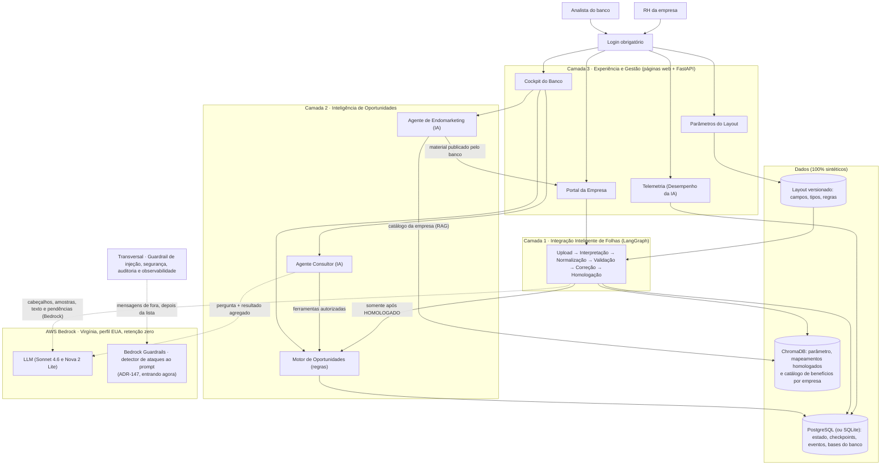

A **camada transversal** não é um componente separado. São controles aplicados em cada fronteira:
upload, chamada ao LLM, ferramentas, persistência, homologação e cockpit (seção 9). Nas mensagens que vêm de fora (o
chat, o comentário, a dica, o destaque e o catálogo), ela chama também o detector de ataques do **Bedrock
Guardrails**, depois da lista de frases (ADR-147).

## 3. Os componentes, um a um

São **7 agentes de IA** (Interpretador, Assistente de Correção, Endomarketing, Consultor e os 3
subagentes do Consultor), **2 etapas determinísticas** no fluxo operacional e **1 motor determinístico** no fluxo
comercial. Critério do plano (§4): é agente quando o LLM toma decisões não triviais; se a regra pode
ser derivada do contrato de dados, é etapa determinística.

| Componente | Tipo | Recebe | Devolve | Tecnologia | Pasta |
|---|---|---|---|---|---|
| Parâmetros do Layout | 🧑 (perfil BANCO) | Campos que o banco quer receber | Nova versão do layout (tipos do catálogo fechado) | Página Parâmetros do Portal Interno + PostgreSQL | `front/`, `api/`, `services/` |
| Ingestão | 📏 | Arquivo bruto + empresa | `FileProfile` (colunas, amostras, hash) | pandas, OpenPyXL | `services/` |
| Agente Interpretador | 🤖 | `FileProfile` + layout vigente + mapeamentos parecidos já homologados (RAG) | `MappingPlan` (origem → destino, justificativa, fonte, status) | LLM + ChromaDB + Pydantic | `agents/` |
| Aceite do mapeamento | 🧑 | `MappingPlan` | Plano aprovado | Página Cadastrar funcionários (front) | `front/`, `api/` |
| Normalizador | 📏 | Plano aprovado + arquivo | Dados no layout vigente + `TransformationLog` | Python, Decimal | `services/` |
| Validador | 📏 (+🤖 só explica) | Dados canônicos + faixas de renda por cargo | `ValidationReport` (BLOQUEANTE / ALERTA / AVISO) | Regras + estatística (mediana e MAD) | `services/` |
| Assistente de Correção | 🤖 + 🧑 | Pendências + respostas da empresa | `CorrectionRequest` aprovado → revalidação | LLM + RAG + LangGraph | `agents/` |
| Homologação | 🧑 | Relatório sem bloqueantes | `HomologationEvent` + arquivo final com checksum | Front + PostgreSQL | `services/` |
| Motor de Oportunidades | 📏 | Somente dados homologados + bases do banco | `OpportunitySummary` | SQL / Python | `opportunities/` |
| Agente Consultor (agente único, ADR-117) | 🤖 | `InsightRequest` do especialista | `InsightResponse` (números vindos das ferramentas) | LLM que escolhe as 4 ferramentas (o supervisor + 3 subagentes fica só na comparação da avaliação) | `agents/` |
| Agente de Endomarketing | 🤖 + 🧑 | Pedido do especialista do banco (empresa, tipo, canal e os benefícios escolhidos) | Rascunho com fontes, que o especialista confere e publica para a empresa baixar (ADR-115) | LLM + trechos do catálogo da empresa | `agents/`, `rag/` |
| Guardrail de injeção | 📏 (+🤖 classificador) | Todo texto externo, e toda resposta de LLM | Texto limpo ou marcado; resposta aprovada ou descartada; evento no Painel | Regras + o detector de ataques do Bedrock Guardrails nas mensagens (ADR-147, entrando agora; antes, um modelo pequeno) | `services/` |
| Telemetria · Desempenho da IA | — | `AgentRunEvent` de cada nó | Métricas e rastros (indicadores do dia a dia em revisão, ADR-82) | Página do Portal do Banco (aba Indicadores, sub-aba Desempenho da IA; ADR-122) | `front/banco_indicadores.html`, `api/` |

### Onde o sistema é multiagente, e onde não é (de propósito)

Definições usadas neste projeto:

| Termo | O que é | Quem decide o próximo passo |
|---|---|---|
| Workflow com LLM | Passos fixos; o LLM executa alguns deles | O código |
| Agente | O LLM decide o que fazer em seguida (ferramenta, nova busca, quando parar) | O LLM |
| Sistema multiagente | Vários agentes que **interagem**: delegam, passam o controle, coordenam | Os agentes, entre si |

O sistema combina os dois modelos, **cada um onde faz sentido**:

- **Fluxo da empresa: workflow controlado.** A sequência upload → mapeamento → normalização →
  validação → homologação é um grafo com caminhos fixos, porque mexe em dado financeiro e precisa
  ser auditável. **Uma interação entre agentes:** o Assistente de Correção pode **passar o controle
  ao Interpretador** (handoff) quando a conversa revela que uma coluna foi mal entendida (seção 4).
- **Fluxo do banco: agente único com ferramentas (ADR-117).** O Consultor escolhe as ferramentas de que a
  pergunta precisa e junta os resultados numa recomendação (seção 5). A versão **supervisor + 3 subagentes**
  continua no código só como o outro braço da comparação: no EXP-005, empatou com o agente único fazendo cerca
  de 67% mais chamadas à IA.

| Agente | Atende | Papel | Ferramentas (allowlist) | Interage com |
|---|---|---|---|---|
| Interpretador | Empresa | Propõe o mapeamento; abstém-se na dúvida | Busca no parâmetro e no histórico (RAG) | Recebe handoff do Assistente |
| Assistente de Correção | Empresa | Conduz as pendências até a homologação | Busca nas regras (RAG); registrar correção; `solicitar_remapeamento` | Passa o controle ao Interpretador |
| Consultor (agente único, ADR-117) | Especialista do banco | Escolhe as ferramentas, junta os resultados e redige a recomendação | `consultar_planejamento`, `simular_ganho`, `comparar_cenarios`, `consultar_status_integracao` (permissão conferida pelo dono de cada uma) | Nenhum: agente único |
| *Só na avaliação:* supervisor + subagentes de Planejamento, Projeção Financeira e Situação da Integração | Comparação da Fase 14 | O supervisor divide a pergunta; cada subagente usa as ferramentas do seu papel | As mesmas 4, divididas por papel | Supervisor delega aos 3 subagentes |
| Endomarketing | Especialista do banco (ADR-115) | Gera o material que a empresa vai divulgar, só com os benefícios que o especialista escolheu | `buscar_beneficios` (filtro obrigatório pela empresa escolhida e pelos benefícios marcados, mais os canais de atendimento); `consultar_resumo_equipe` (só o total) | Nenhum: agente único, de propósito |

**Controles da interação:** cada agente só usa as ferramentas do seu papel; há limite de handoffs e
de delegações por pedido; todo remapeamento volta para aprovação humana; cada handoff e cada
delegação gera um `AgentRunEvent`, visível na Telemetria (Desempenho da IA).

**O multiagente precisa provar que vale a pena.** A avaliação (Fase 14) compara o Consultor
**agente único** (um LLM com todas as ferramentas) com o Consultor **supervisor + subagentes**, nas
mesmas perguntas golden, medindo exatidão, custo e latência. Se o multiagente não ganhar, o
resultado é registrado.

### O parâmetro do layout: o banco diz o que quer receber

Na tela **Parâmetros do Layout** (perfil BANCO), o banco cadastra os campos que quer receber, ou
importa uma planilha com eles. Cada gravação cria uma **nova versão**, e cada processamento registra
a versão que usou: mudar o layout não altera homologações antigas.

| Coluna | Exemplo | Quem usa |
|---|---|---|
| `campo` | `salario_bruto` | Todos |
| `descricao` | Salário mensal antes dos descontos | Interpretador (entender o significado) |
| `tipo` | `DECIMAL_MONETARIO` | Normalizador e Validador |
| `obrigatorio` | S | Validador |
| `regra` | `>= 0` | Validador |
| `nao_confundir_com` | salário líquido, vencimentos | Interpretador (abster-se em vez de chutar) |
| `sensivel` | S | Marcação "Dado pessoal (LGPD)": classifica o campo no inventário de dados pessoais do banco (base do RIPD); não esconde nada (ADR-101) |
| `exemplo` | 5200.50 | Interpretador e tela de ajuda |

**O tipo vem de um catálogo fechado** (ex.: `TEXTO`, `CPF`, `CNPJ`, `CEP`, `UF`, `MATRICULA`,
`DECIMAL_MONETARIO`, `DATA`, `COMPETENCIA`, `DOMINIO`). O banco cria os campos que quiser, mas não inventa conversões.
É isso que mantém o Normalizador e o Validador determinísticos, e é o que torna barato ter muitos
campos: um campo novo de um tipo já conhecido não exige código novo.

**Tamanho real do problema.** O arquivo que as empresas preenchem hoje tem **44 informações**, em
grupos: dados do funcionário, endereço, cargo e vínculo (ex.: data de efetivação) e dados da
empresa ou do estabelecimento em que o funcionário está alocado (ex.: CNPJ, endereço). A versão 1
do layout da demo é **fictícia, mas na mesma escala e com os mesmos grupos**, sem copiar nomes ou
regras do layout real, que é material interno. Isso amplia o contrato de ~10 campos do plano
(§14.2), que passa a ser um subconjunto.

**Por que o Normalizador não usa IA:** depois que o mapeamento está aprovado, a conversão é
consequência do tipo do campo de destino. Um LLM aqui só acrescentaria custo, latência e risco de
errar um valor financeiro.

**Enquadramento de renda (Validador).** Empresas às vezes informam renda muito acima ou abaixo do
esperado, por erro de digitação ou possível fraude. O arquivo é uma **carga inicial** (a empresa envia a lista
uma vez), então não há histórico do funcionário: o Validador compara cada renda com a mediana do
mesmo cargo (mediana + MAD; tabela de referência por cargo
quando a amostra é pequena; CLT e pró-labore separados). O resultado é um **ALERTA** tratado por um
humano, nunca uma acusação. A resolução (erro, confirmado, suspeito) fica registrada e, no futuro,
vira rótulo para treinar um modelo de risco.

## 4. Jornada operacional: do upload à homologação

Orquestrada pelo **LangGraph**. Cada 🧑 é uma **pausa** (interrupt): o grafo grava o ponto em que
parou no banco (checkpointer, no PostgreSQL ou no SQLite) e só continua quando o humano responde, mesmo que a página seja
recarregada.

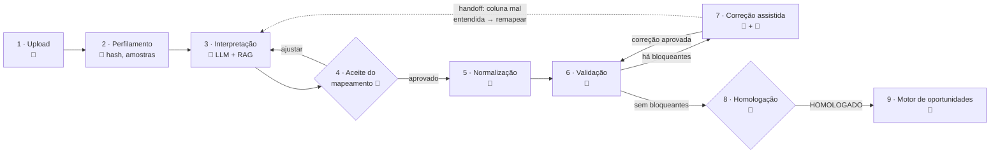

**O handoff (linha pontilhada).** Durante a correção, a empresa pode revelar que uma coluna foi mal
entendida: "essa coluna 'Valor' é o salário líquido, não o bruto". O **Assistente de Correção
decide** passar o controle ao Interpretador pela ferramenta `solicitar_remapeamento`, informando a
coluna e o que a empresa explicou. O Interpretador propõe o novo mapeamento, que **volta para o
aceite humano (passo 4)** e segue normalmente para normalização e validação. O número de handoffs
por processamento é limitado.

**Estados do processamento** (§Fase 8):
`RECEBIDO → PERFILADO → MAPEAMENTO_PENDENTE → MAPEAMENTO_APROVADO → NORMALIZADO → VALIDACAO_PENDENTE → HOMOLOGADO | REJEITADO`

O laço 6 ⇄ 7 tem **limite de tentativas**. A data ambígua do Normalizador (01/02) também vira
pendência para o passo 7, nunca um chute.

**Dois tipos de carga, o mesmo fluxo.** `INICIAL`: a lista completa de funcionários, enviada uma
vez, na entrada da empresa. `INCLUSAO`: só os funcionários novos. **O tipo é uma regra, não uma
pergunta:** se a empresa ainda não tem funcionários homologados, é `INICIAL`; se já tem, é
`INCLUSAO`. Na inclusão:

- se as colunas são as mesmas de um mapeamento já homologado da empresa, ele é **reaproveitado**,
  e o LLM só é chamado para colunas novas ou diferentes;
- CPF ou matrícula já homologados na empresa viram pendência (duplicidade ou reenvio);
- o enquadramento de renda compara o novo funcionário com os colegas já homologados;
- o motor processa só os funcionários novos, sem recontar ninguém.

**Desligamentos ficam fora do escopo:** o banco já os identifica quando o salário deixa de cair na
conta do funcionário.

**Pendência em aberto:** funcionário que já tinha vínculo com outra empresa e aparece na inclusão
de uma nova (troca de emprego). Por ora, entra como inclusão normal na nova empresa, porque a
duplicidade só é checada dentro da mesma empresa. O tratamento do vínculo anterior será definido
depois.

### Os arquivos que não são uma tabela: o Leitor de fichas (ADR-130)

Antes do passo 2, o **Leitor de fichas** (`services/leitura_de_fichas.py`) olha a forma do arquivo e só entra em
dois casos. Em todos os outros, a leitura de tabela segue como sempre.

| Caso | Como reconhece | O que faz | IA |
|---|---|---|---|
| **Abas ligadas** | 2 ou mais abas com cabeçalho e uma coluna de identificador em comum (CPF primeiro; matrícula ou código com número) | Junta as abas numa linha por pessoa; quem só está numa aba entra com aviso | Não |
| **Fichas em texto** | Uma coluna de texto longo que junta 2 ou mais tipos de dado por célula, sem coluna própria de CPF | Junta os pedaços de cada referência (a coluna que separa os CPFs) e manda ao Leitor de Documentos **uma pessoa por vez** | Sim |

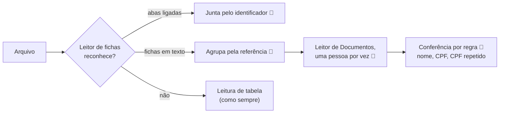

- **Parar em vez de adivinhar:** se não há referência e a maioria das linhas não tem CPF, os pedaços não têm dono, e o
  arquivo é recusado com o que fazer. A coluna que juntaria dois CPFs nunca é usada como referência.
- **A regra depois da IA:** nome com número ou "@" sai e vira pergunta; CPF com dígito errado e CPF repetido viram
  pergunta presa à pessoa (pendência na conferência).
- **A leitura com IA fica guardada** ao lado do original, como a do Word: as etapas seguintes não pagam de novo.

### A faixa salarial por profissão (CBO, ADR-129)

O Validador já comparava o salário com os **colegas de cargo da própria empresa** (`RENDA_FORA_DO_CARGO`, ADR-14).
Desde o ADR-129, ele compara também com duas referências **de fora** da empresa, por **profissão**:

| Referência | De onde vem | Quem vê |
|---|---|---|
| Faixa pública da profissão | RAIS 2025 (Ministério do Trabalho): percentis 5 e 95 do salário de dezembro dos vínculos CLT ativos, com 30 h ou mais por semana | a empresa, no alerta; o banco consulta e edita na página Parâmetros |
| Faixa das outras empresas | os funcionários já cadastrados de **outras** empresas na mesma profissão (percentis 5 e 95) | a empresa vê só os dois números, e só com 2 empresas e 10 pessoas no mínimo |

- **A profissão é o código CBO** (Classificação Brasileira de Ocupações, a lista oficial do Ministério do Trabalho,
  em `data/cbo/`). Ele chega de dois jeitos:
  - **pela coluna "Código CBO" do arquivo** (o campo `codigo_cbo` do parâmetro);
  - **ou pelo nome do cargo:** uma busca por regras nos títulos e sinônimos da CBO, sem IA (`services/tabela_cbo.py`).
    A sugestão **nunca vale sozinha**: vira a pergunta `CBO_A_CONFIRMAR`, uma por cargo, e a resposta da empresa fica
    em `cbo_dos_cargos`.
- **Liga com o campo:** a comparação só acontece quando o parâmetro vigente tem o campo `codigo_cbo`, que o banco
  cria na tela Parâmetros. Sem ele, os envios ficam como eram.
- **Um alerta por pessoa** (`RENDA_FORA_DA_PROFISSAO`), que cita as faixas de que o salário saiu. Ele não recusa
  nada: a empresa corrige ou confirma.
- **Os dados públicos, agregados:**
  - os microdados da RAIS ficam em `storage/fontes_publicas/`, fora do Git;
  - a aplicação só guarda o mínimo e o máximo por profissão (`data/cbo/faixas_salariais_cbo.csv`, carregado na
    tabela `faixas_salariais_cbo`);
  - `scripts/calcular_faixas_cbo.py` refaz o cálculo, e `data/cbo/fontes.json` guarda de onde veio cada arquivo e a
    soma de conferência dele.
- **A edição do banco:**
  - a faixa em uso pode ser editada, e a calculada fica ao lado, para voltar a ela;
  - cada edição guarda quem mudou, quando, e os valores de antes e de depois (`faixas_salariais_cbo_alteracoes`);
  - o mínimo nunca pode ficar maior que o máximo.

## 5. Jornada comercial: planejamento, não ofertas

O motor responde às perguntas de **planejamento** do especialista do banco: quantas contas novas
abrir, em qual região, quantos funcionários são novos e quantos já são correntistas, e qual o ganho
projetado se o relacionamento for conquistado. **Não gera ofertas nem listas de pessoas**: só
números agregados. A tabela por funcionário existe apenas internamente, para rastrear cada número
até a origem. Todas as análises podem ser filtradas por empresa, região (endereço comercial) e
**segmento**, sempre lido da base oficial do banco. O ciclo de vida do cliente (onboarding,
portabilidade, encerramento) ficou fora do escopo.

O Consultor é um **agente único com ferramentas** (ADR-117): lê a pergunta, escolhe de uma vez as ferramentas
de que ela precisa e junta os resultados. Nenhum agente calcula nada; os números vêm do motor.

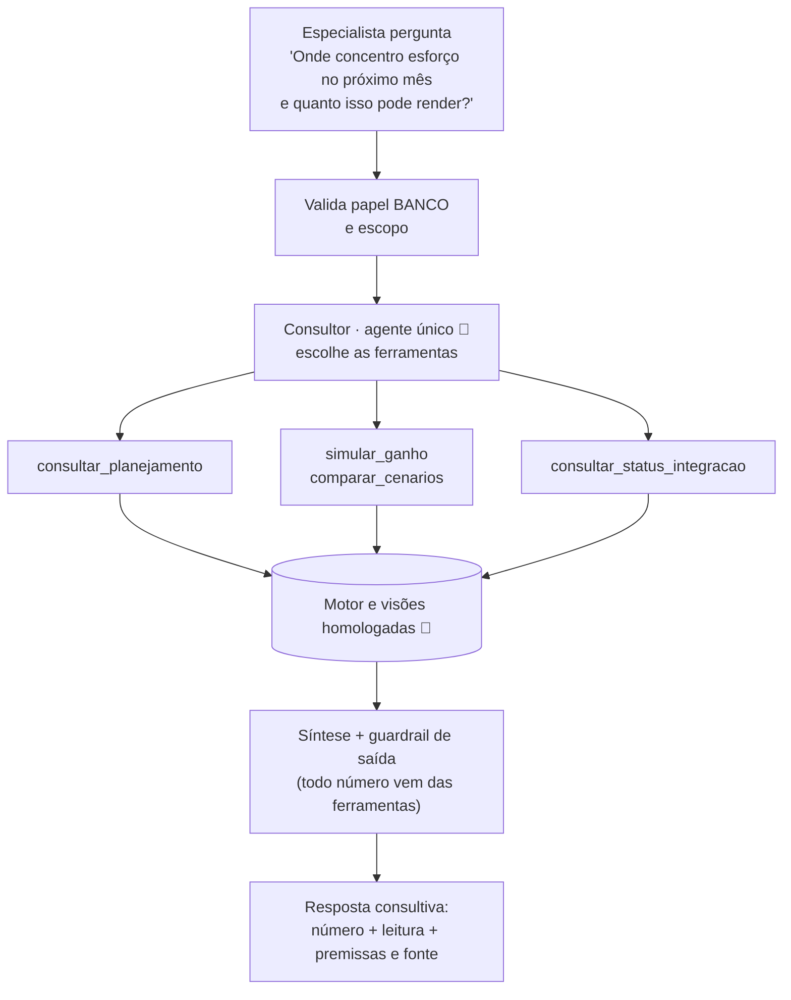

**O outro braço da comparação (só na avaliação): supervisor + 3 subagentes.** O supervisor divide a pergunta,
delega a subagentes especializados e junta as respostas:

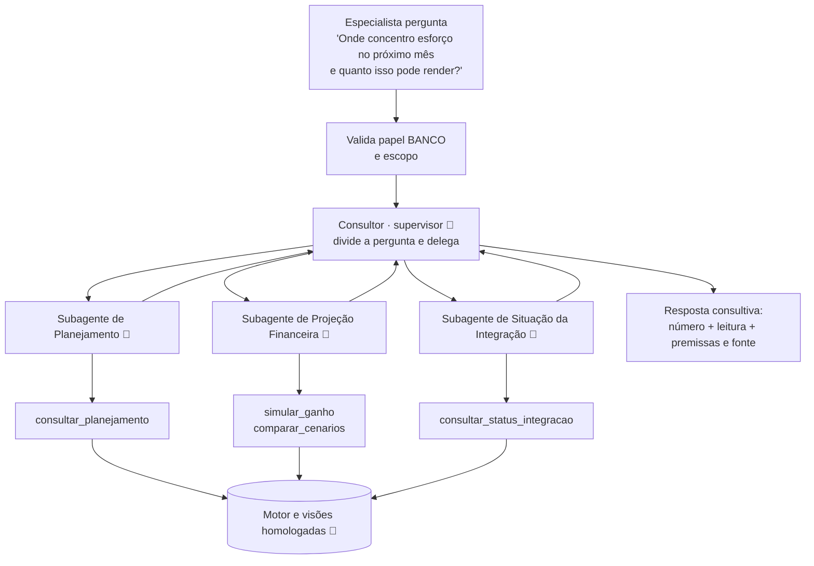

**Exemplo de divisão (no supervisor):** para "onde concentro esforço no próximo mês e quanto isso pode render?", o
supervisor pede ao Planejamento as contas a abrir por unidade, à Situação da Integração as
empresas com carga pendente e à Projeção o ganho por cenário. Depois sintetiza: "a unidade de
Campinas concentra 29 aberturas; a Prisma ainda tem carga pendente, o que pode somar mais 40; com
20% de conquista, o ganho projetado é de R$ X em 12 meses".

**Premissas financeiras parametrizáveis.** A projeção lê uma tabela versionada, editada pelo banco
numa aba da tela de parâmetros. Valores iniciais: MOB 12m do cliente folha R$ 2.090,62, do não folha
R$ 1.724,00 e do cliente novo conquistado R$ 2.090,62. Correntista recuperado rende
n × (folha − não folha); não correntista rende n × taxa de conquista × MOB de cliente novo. **Não
há taxa de conquista padrão:** o especialista informa a taxa em cada simulação, e o Consultor pede
a taxa quando ela falta, em vez de supor uma. Cada
simulação registra a versão das premissas. A **região** é sempre a do endereço comercial (unidade
de trabalho).

A resposta é **consultiva**: número, leitura para o planejamento e premissas. A leitura só pode se
apoiar nos números devolvidos pelos subagentes. Não há SQL livre: cada subagente só chama as
ferramentas do seu papel, com filtros tipados, e a autorização é checada **no serviço de dados**,
não no prompt.

### Endomarketing: o banco gera, a empresa comunica (ADR-115)

O banco não faz oferta ativa para quem não é correntista. Quem orienta o funcionário a abrir a conta
é a **empresa**. O Agente de Endomarketing produz o material para isso, e com isso aumenta a
**taxa de conquista**, o mesmo número que o especialista informa na projeção. Desde o ADR-115 (2026-09-28),
**quem gera e valida é o especialista do banco**, na aba Endomarketing do Portal Interno; a empresa só baixa e
divulga. Motivo: o benefício é do banco, e a empresa não pode divulgar um benefício sem a validação dele.

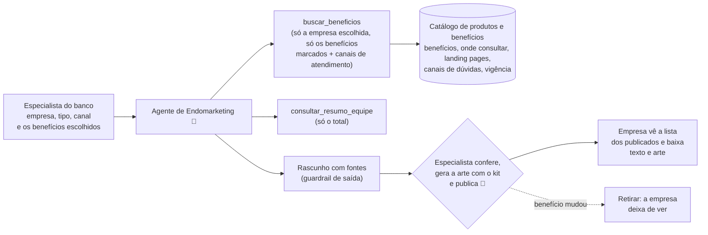

- **Base de conhecimento:** o catálogo que o banco definiu **para cada empresa**: benefícios negociados, onde
  consultá-los, landing pages, canais de dúvidas e vigência. Desde o ADR-125, ele é **montado das KBs de benefício e de
  atendimento publicadas** no Endomarketing, guia Base de Conhecimento (a subida manual saiu). Na demo, os links são fictícios, no domínio
  reservado `.example`.
- **Formato:** documentos **Markdown (`.md`)**, com versão e vigência. O índice corta cada documento **por seção**
  (títulos `##`), para que cada trecho faça sentido sozinho. O conteúdo é tratado como dado, nunca como instrução, e a
  prévia não executa HTML.
- **O que gera:** comunicado interno (e-mail ou intranet), FAQ para os funcionários, kit de
  boas-vindas e lembrete para abrir a conta (sempre para toda a equipe), no tamanho do canal (e-mail, mural ou
  WhatsApp). O kit conecta com as **inclusões**: quando uma carga de inclusão é homologada, o Portal Interno sugere
  ao especialista o kit para os novos funcionários.
- **Benefícios escolhidos:** em cada material, o especialista marca quais benefícios do catálogo vigente da empresa
  entram (pelo menos 1). A IA recebe só os trechos desses benefícios, mais os canais de atendimento.
- **Nada é inventado:** cada afirmação cita o documento de onde veio; bloco sem fonte ou com número que não está no
  trecho sai (guardrail de saída); se a informação não está no catálogo, o agente diz que não sabe. Nada é publicado
  automaticamente: o especialista confere e **publica**; pode **retirar** depois (ex.: o benefício mudou).
- **Situações do material** (`materiais_endomarketing`): RASCUNHO → PUBLICADO ou DESCARTADO; PUBLICADO → RETIRADO. Os
  aprovados pela empresa no modelo anterior (APROVADO) não aparecem mais para ela.
- **Kit de marca e arte:** o kit próprio da empresa tem as cores e o logo (PNG ou JPEG até 500 KB, tabela
  `logos_dos_kits`). A arte é desenhada no navegador do especialista com esse kit e guardada ao publicar
  (`artes_dos_materiais`); a empresa baixa exatamente a imagem validada.
- **Total da equipe sem conta:** o Portal Interno mostra ao especialista o total exato de funcionários da empresa que
  ainda não têm conta, como sugestão de lembrete. O comunicado vai para toda a equipe, por isso nunca cita pessoas. A
  conta de cada funcionário a empresa já vê na tela "Acompanhar cadastros", por consentimento dado na abertura da
  conta (ADR-102). *Premissa a validar com o jurídico (sigilo bancário).*
- **Por que é um agente único:** uma ferramenta de busca e um tipo de tarefa. Dividir em subagentes
  só acrescentaria custo.

### As KBs de endomarketing: o conhecimento do agente, padronizado e com trava (ADR-125)

O que o agente sabe para escrever o material fica num **repositório de KBs** (bases de conhecimento curtas, todas no
mesmo modelo: `data/kbs_endomarketing/MODELO.md`), gerido nas guias da aba **Endomarketing** do Portal Interno
(desde 29/09): **Base de Conhecimento** (as KBs da empresa escolhida, com os Benefícios na primeira aba, "Aguardando
publicação" e o "Histórico anterior" congelado) e **Regras gerais** (diretrizes gerais e Santander, iguais para todas as
empresas). A antiga tela "Benefícios e KBs" foi aposentada: o endereço dela leva às guias.

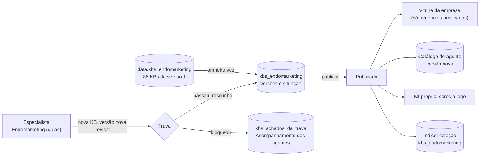

- **Três grupos de dono:** **GERAL** (tom de voz, termos proibidos, guardrails, diretrizes, canais, glossário e a
  jornada padrão), **SANTANDER** (o kit da marca padrão e a prateleira de benefícios) e cada **empresa** (benefícios,
  jornada de contratação, landing page, kit da marca e canais de atendimento).
- **A trava** confere toda gravação e publicação: ficha e seções do modelo, termos proibidos (lidos da KB publicada de
  termos), valor em R$ ou % sem "(simulação)", CPF, frase de ordem para a IA e logo com caminho. A frase de ordem é
  conferida pela lista de frases, sem chamar a IA: a KB é uma lista de regras escrita pelo banco e publicada por uma
  pessoa (ADR-147). Bloqueio e aviso ficam
  registrados, com o trecho, quem e quando.
- **Versões:** rascunho → publicada (a anterior vira substituída) → retirada. Revisar renova a vigência de uma KB
  vencida ou vencendo em 30 dias.
- **A vitrine da empresa** lê só as KBs de benefício publicadas e vigentes dela, mais a KB de atendimento.
- **Aplicar na empresa** (sozinho, ao publicar, retirar ou renovar um benefício, o atendimento ou o kit; sem botão
  nem mensagem na tela desde 29/09): versão nova do catálogo do
  agente, kit próprio com as cores da KB e o logo (fictício, gerado por `scripts/gerar_logos_das_kbs.py`).
- **Busca isolada:** `rag/kbs_endomarketing.buscar_kbs(empresa_id, pergunta)` só olha GERAL, SANTANDER e a empresa.
  Publicar troca no índice só a KB publicada; `scripts/indexar_kbs_endomarketing.py` monta a coleção inteira.
- **Contexto do agente:** `GET /api/banco/kbs-endomarketing/contexto/{empresa_id}` junta as KBs gerais, o kit (da
  empresa ou do Santander), a jornada, o atendimento, os benefícios e a landing page publicados, cada um com a fonte.
- **Código:** `services/kbs_endomarketing.py` (modelo, trava, versões), `services/kbs_publicacao.py` (vitrine, catálogo,
  kit e contexto), `api/rotas_kbs_endomarketing.py` (rotas só do BANCO), `front/banco_endomarketing.html` com
  `front/js/banco_beneficios.js` (as guias das KBs) e
  `front/js/banco_agentes_kbs.js` (a seção "Guardrails das KBs" do Acompanhamento dos agentes).

### A opinião sobre os agentes: o joinha (ADR-151)

Quem usa o sistema diz, com um clique, se a resposta de um agente ajudou. É o retorno das pessoas, que as avaliações
automáticas (as métricas contra o gabarito) não medem.

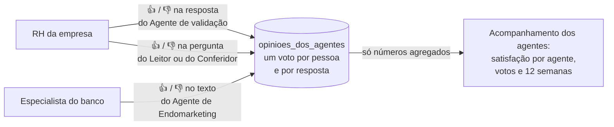

- **Onde:**
  - embaixo de cada resposta do Agente de validação (Cadastrar, Acompanhar e Resolvidas);
  - embaixo da pergunta, nas pendências de pergunta da leitura;
  - no rascunho e na janela "Ver" do material do Endomarketing.

  O Portal Interno não tem conversa com o Assistente de Correção (é o mesmo Agente de validação da empresa), então esse
  joinha fica só na empresa.
- **As regras:**
  - um voto por pessoa e por interação: mudar de ideia troca o voto, e clicar de novo retira;
  - a empresa só vota nos envios dela;
  - o comentário é opcional, só no 👎, com até 200 letras. Ele fica à vista embaixo do joinha de quem votou ("Seu
    comentário", com o "Editar") e nunca aparece para o banco: lá, só a contagem.
- **Os números** ficam no Acompanhamento dos agentes (menu Sistema), depois dos cartões do trabalho de cada agente:
  - a satisfação é a parte dos votos com o 👍;
  - a seção segue o período do alto da tela (7, 30 ou 90 dias, Tudo ou De/até), pelas datas de Brasília;
  - a linha das 12 semanas termina no fim do período e vira à meia-noite de Brasília. A comparação junta as 4
    primeiras e as 4 últimas, com pelo menos 5 votos em cada ponta.
- **Dados de demonstração:** `scripts/gerar_opinioes_dos_agentes.py` (semente fixa, origem "carga sintética",
  `--remover`).
- **Código:**
  - `services/opiniao_dos_agentes.py` e `api/rotas_opiniao_dos_agentes.py`;
  - `front/js/opiniao_dos_agentes.js` (o joinha) e `front/js/banco_opiniao_dos_agentes.js` (a seção do
    Acompanhamento dos agentes);
  - `front/css/opiniao_dos_agentes.css`.

## 6. Como o RAG funciona aqui

O projeto tem **três bases de conhecimento**, com papéis diferentes:

| Base | Conteúdo | Quem usa | Por que RAG |
|---|---|---|---|
| Conhecimento do layout | Parâmetro, regras, mapeamentos homologados | Interpretador, Assistente de Correção | **A provar:** B2 × B3 mede se vale mais que mandar tudo no prompt |
| Catálogo de benefícios | Documentos de produtos e benefícios por empresa | Agente de Endomarketing | **Caso clássico:** muitos documentos em texto, que mudam e precisam ser filtrados por empresa |
| Mapeamentos aprovados | Pares coluna → campo aprovados pelo banco, sem dado de empresa | Interpretador (só com o aprendizado ligado) | **A memória que aprende:** cresce a cada envio aprovado (ADR-70) |

A seguir, a base do layout:

**Não existe manual de integração no banco hoje.** A base de conhecimento é montada com o que
existe de fato: o **parâmetro do layout** (o que cada campo significa, com o que não confundir),
as **regras de validação** e o **histórico de mapeamentos homologados** (sintético, fixo). Cada envio
aprovado pelo banco ensina ao sistema, por exemplo, que "Colaborador" significa `nome_funcionario`, pela terceira
base, a dos mapeamentos aprovados (desenho abaixo). A base cresce com o uso, e é esse crescimento que justifica
buscar o que é relevante em vez de enviar tudo ao LLM.

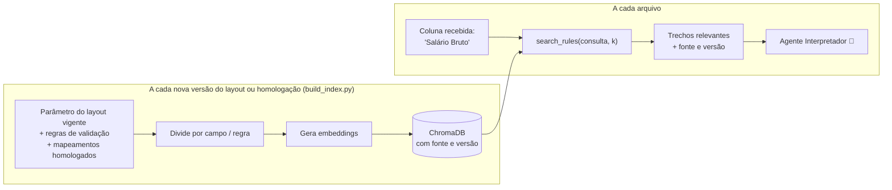

O índice guarda **apenas conhecimento sobre colunas e regras**, nunca folha, CPF ou salário. O RAG ser necessário é uma
hipótese a testar, não um pressuposto: a avaliação compara RAG (B3) com todo o conhecimento
colocado no prompt (B2). Ver [avaliacao.md](avaliacao.md).

### A memória que aprende: mapeamentos aprovados pelo banco (ADR-70)

Quando o banco aprova um envio, os pares que a empresa aceitou vão para o histórico no banco de dados e, dali, para
um índice próprio. Na próxima planilha, de **qualquer** empresa, a busca já encontra "esta coluna foi aprovada como
tal campo" e cita a fonte.

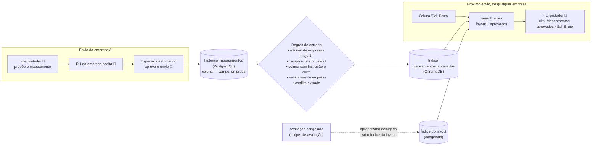

- **Quem liga:** a API liga o aprendizado ao abrir. Os scripts de avaliação e os testes não ligam, então
  a prova continua medindo o mesmo conhecimento (ADR-58).
- **Por que só com a aprovação do banco:** o par passou por duas pessoas (o RH aceitou, o banco aprovou). Nada do
  chat, nada de célula da planilha (ADR-38).
- **Se o índice falhar:** a aprovação vale do mesmo jeito; o próximo `scripts/build_index.py` refaz o índice a partir
  do histórico.

### Os quatro tipos de memória da IA, neste sistema

| Tipo | O que é | Aqui |
|---|---|---|
| Curto prazo | O que a IA tem na mesa agora | A janela de contexto de cada chamada (colunas com amostras, trechos do RAG, a pendência, a pergunta); entre as etapas, o checkpoint do LangGraph, sem dado pessoal (ADR-15, ADR-49), guardado para sempre: mostra onde a empresa parou (ADR-71 revisto) |
| Episódica | Casos que já aconteceram | O último mapeamento aprovado da empresa (ADR-24) e os mapeamentos aprovados pelo banco (ADR-70) |
| Semântica | Fatos e conceitos | O layout de 44 campos, as regras e o catálogo de cada empresa, no RAG com filtro por empresa e vigência (ADR-10) |
| Procedural | Como fazer a tarefa | Prompts versionados (`prompts/*_vN.md`), contratos de saída, ferramentas permitidas e o exemplo resolvido tirado só do treino (ADR-07, ADR-20, ADR-37) |

O modelo em si (memória **paramétrica**) não aprende com os dados do banco: o ajuste fino está adiado (ADR-06). As
conversas não guardam histórico entre perguntas: cada uma recomeça do banco de dados, e uma instrução maliciosa não se
acumula.

## 7. Onde os dados ficam

| Dado | Onde | Quem lê |
|---|---|---|
| Arquivos enviados e golden | `data/synthetic/`, `data/golden/` | Ingestão, Normalizador, Validador (arquivo completo, local) |
| Estado, checkpoints, eventos, bases do banco | PostgreSQL (SQLite nos testes; ADR-67) | LangGraph, motor, Telemetria |
| Parâmetros do layout (versionados) | PostgreSQL (SQLite nos testes) | Tela de parâmetros, Interpretador, Normalizador, Validador |
| Parâmetro + mapeamentos homologados indexados | ChromaDB | Interpretador e Assistente de Correção |
| Mapeamentos aprovados pelo banco (histórico e índice) | PostgreSQL (`historico_mapeamentos`) + ChromaDB (`mapeamentos_aprovados`) | Interpretador, com o aprendizado ligado |
| Catálogo de produtos e benefícios por empresa (versionado, com vigência) | PostgreSQL + ChromaDB | Agente de Endomarketing (só o catálogo da própria empresa) |
| Materiais de endomarketing, logo do kit e arte publicada (ADR-115) | PostgreSQL (`materiais_endomarketing`; `logos_dos_kits` e `artes_dos_materiais`, com a imagem em base64 num campo de texto) | O especialista gera e publica; a empresa lê só os publicados dela |
| O que vai para o LLM | Cabeçalhos e amostras reais, o texto do documento, a pendência com o valor; só o necessário para cada tarefa (ADR-101) | O modelo, pelo AWS Bedrock (perfil EUA, retenção zero; ADR-96) |
| Segredos (chaves de API, senhas) | Variáveis de ambiente / secrets do servidor | Nunca no Git nem no navegador |

Como cada dado é produzido, guardado, usado e descartado, e a ficha do dataset sintético (composição,
erros injetados, limitações e usos permitidos): [`dados.md`](dados.md).

## 8. Implantação e acesso

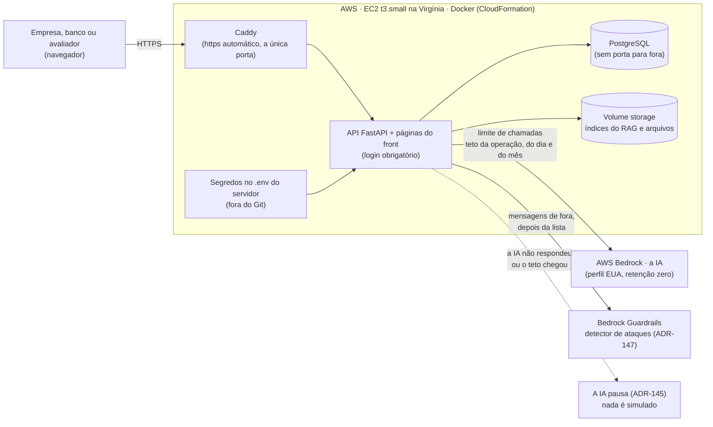

- **Por que container com processo contínuo:** a API mantém conexão aberta e estado (conexão com o
  PostgreSQL, índice, arquivos). Plataformas serverless, como a Vercel, não atendem.
- **Login obrigatório:** sem login, nenhuma tela abre e nenhuma chamada ao LLM é feita (teste da §17).
  - **Decidido (2026-09-23):** usuário e senha, com **cadastro de usuários** que indica o perfil de
    cada um. Tabela `usuarios` no SQLite: `login`, `senha_hash` (nunca a senha em texto),
    `perfil` (EMPRESA / BANCO) e `empresa_id` (obrigatório para o perfil EMPRESA). O perfil CIENTISTA saiu em
    2026-09-26 (ADR-78): o banco tem a gestão completa.
  - O perfil vem do cadastro, não de uma escolha na tela: quem entra como usuário da Aurora só vê a
    Aurora. O escopo é conferido nos serviços, não só na interface.
  - As senhas iniciais vêm dos secrets do servidor e nunca entram no Git.
  - Alternativa descartada: `st.login` via OIDC (Google/Microsoft), que exige configurar um provedor
    de identidade e não carrega o perfil nem a empresa do usuário.
- **Proteção de custo:** limite de chamadas e teto de gasto por operação, tetos do dia e do mês (ADR-131) e o alerta
  do AWS Budgets. A IA que não responde **pausa**, e nada é simulado no lugar (ADR-145); o MOCK de reserva existe só na
  máquina local. A checagem do Bedrock Guardrails tem um tempo máximo: se estourar, a mensagem segue só com a lista de
  frases, e a Telemetria registra (ADR-147).
- **Reprodutível fora do servidor:** o mesmo Dockerfile roda na máquina do avaliador; `MODE=mock`
  funciona sem chave de API.
- **A data da versão no rodapé (ADR-133):** todas as telas mostram "Atualizado em DD/MM/AAAA às HH:MM", a data do
  último commit da versão que o servidor carregou. Fonte única: `services/versao_da_aplicacao.py`, pela rota
  `GET /api/versao` (sem login). Na máquina local, a data vem do Git. Na imagem montada pelo `git archive` do
  `publicacao/publicar.sh`, vem do `versao_da_aplicacao.txt`, que o Git preenche (regra `export-subst`). A variável
  `DATA_DA_VERSAO` vale mais que as duas. Sem data, não há rótulo.
  - **Oculto nesta versão (ADR-148):** o lugar do rótulo tem a marca `data-oculto-nesta-versao` em todas as telas, e
    o script não o escreve. A rota e o código ficam.
- **O teto de gasto da IA, visto e ajustado pelo banco (ADR-131 e ADR-139):**
  - **A regra do teto** fica em `services/teto_de_gasto.py`: a soma do gasto do dia, os tetos do dia e do mês, e a
    pausa da IA quando um deles é atingido.
  - **A página "Teto de gasto da IA"** (`front/banco_teto_da_ia.html`, só BANCO) mostra o gasto × os tetos e a pausa,
    ajusta um teto por vez e guarda o histórico em `mudancas_do_teto_da_ia`. O serviço é
    `services/pagina_do_teto_da_ia.py`, pelas rotas `/api/banco/teto_da_ia`.
  - **O acesso** é pelo link no painel dos dados da IA (Acompanhamento dos agentes). Com a IA pausada, uma faixa
    amarela aparece no alto das outras telas do Portal (`front/js/aviso_do_teto_da_ia.js`).
  - **A retomada automática:** quando o teto sobe, ou a cada 5 minutos (a virada do dia ou do mês), os envios parados
    pelo teto voltam sozinhos para a análise. É o mesmo caminho do botão "Tentar de novo" da empresa, com uma
    retomada de cada vez.

## 9. Segurança em cada fronteira

| Fronteira | Ameaça | Controle | Teste |
|---|---|---|---|
| Acesso | Pessoa sem permissão | Login obrigatório | Acesso sem login é negado |
| Upload | Arquivo malicioso ou gigante | Extensão, MIME, tamanho, linhas; fórmulas rejeitadas | Arquivo inválido é recusado |
| LLM | Prompt injection em célula, cabeçalho, chat ou catálogo | **Guardrail de injeção** na entrada (lista de padrões + o detector de ataques do Bedrock Guardrails nas mensagens, ADR-147; remove o trecho suspeito do arquivo, marca o chat, recusa o documento) e na saída (schema, campos do parâmetro, números das ferramentas, fontes) (ADR-38) | Célula "ignore as instruções" não muda o resultado |
| RAG | Envenenamento do histórico | Só mapeamentos homologados por humano entram, como pares estruturados | Cabeçalho malicioso não vira conhecimento sem homologação |
| LLM | Vazamento de dado pessoal | Privacidade pelo destino: só pelo AWS Bedrock, perfil EUA, retenção zero, sem acesso do fornecedor; modelos que guardam pedidos recusados antes de sair (ADR-96, ADR-101) | `tests/test_provedores_de_ia.py`: perfil EUA e recusa dos modelos que guardam pedidos |
| Saída do LLM | Resposta fora do formato | Validação Pydantic + nova tentativa | Saída inválida é rejeitada |
| Dados | Alteração indevida | Aprovação humana; catálogo fechado de operações | Nada muda sem clique |
| Consulta | Empresa A ver dados da B | Escopo aplicado no serviço | Acesso negado |
| Consultor | SQL livre | Allowlist de ferramentas por subagente | Tentativa de SQL é bloqueada |
| Entre agentes | Laço infinito ou agente usando ferramenta de outro | Limite de handoffs e delegações; allowlist por agente | Subagente não chama ferramenta de outro papel; laço é interrompido |
| Endomarketing | Condição de produto inventada ou benefício divulgado sem o banco validar | Toda afirmação vem dos benefícios escolhidos pelo banco, com fonte; recusa quando falta informação; só o especialista do banco publica, e a empresa vê só os publicados (ADR-115) | Pergunta sem resposta no catálogo é recusada; fidelidade às fontes medida; empresa não vê rascunho nem retirado |
| Endomarketing | Empresa A ver o pacote da B | Filtro por empresa aplicado na busca, não no prompt | Busca nunca retorna documento de outra empresa |
| Endomarketing | Sigilo bancário | O comunicado vai para toda a equipe e nunca cita pessoas; o total exato de funcionários sem conta fica no cartão da empresa (ADR-102) | Comunicado nunca identifica quem é correntista |
| Exportação | CSV injection | Sanitização das células | Fórmula não executa |
| Logs | Dado pessoal em log | Eventos sem payload pessoal | Painel sem CPF ou salário |

## 10. Escalável, segura e eficiente (exigência do enunciado)

A arquitetura do MVP foi escolhida para **provar o fluxo em uma semana**. A lógica fica isolada em
`services/`, `agents/` e `opportunities/`, o que permite trocar as peças de infraestrutura sem
reescrever as regras.

| Aspecto | No MVP | Em produção |
|---|---|---|
| Interface | FastAPI + páginas HTML e JavaScript (`front/`), reaproveitando `services/` (o Streamlit do início saiu, ADR-108) | O mesmo front atrás de https, com SSO corporativo |
| Persistência | PostgreSQL (SQLite nos testes; ADR-67) | PostgreSQL gerenciado; DuckDB para análise |
| Busca vetorial | ChromaDB local | Serviço vetorial gerenciado, conforme volume |
| Processamento | Síncrono, um arquivo por vez | Fila de processamento e workers |
| Identidade | Login simples | SSO corporativo |
| Hospedagem | Render/Railway | Infraestrutura interna do banco |
| Eficiência | IA só onde há ambiguidade; regras sem custo de API; mapeamento homologado reaproveitado nas inclusões | Idem; Fine-Tuning de um modelo pequeno só se o volume justificar (ADR-80) |
| IA | AWS Bedrock na conta do projeto, perfil EUA, retenção zero; a IA vê os dados (ADR-96, ADR-101) | Nuvem que o banco já contrata (Bedrock, Vertex, Azure) ou modelo aberto no servidor do banco (ADR-81) |
| Segurança | Seção 9 | Seção 9 + aprovação corporativa do provedor de LLM e retenção zero |

## 11. Por que o desenho é assim

Cada parte do desenho aponta para o ADR que explica as opções disponíveis e a escolha feita.

| Parte do desenho | Pergunta que o ADR responde | ADR |
|---|---|---|
| Princípio IA / regra / humano | Por que não deixar o LLM fazer tudo? | [01](decisoes.md#adr-01) |
| Workflow + multiagente pontual | Por que só parte do sistema é multiagente? | [02](decisoes.md#adr-02) |
| Parâmetros do Layout | Por que uma tela, e não um manual ou layout no código? | [03](decisoes.md#adr-03) |
| Catálogo fechado de tipos | Por que o banco não inventa conversões? | [04](decisoes.md#adr-04) |
| Agente Interpretador (B0–B3) | O RAG é mesmo necessário? | [05](decisoes.md#adr-05) |
| Modelo pequeno ajustado (B4–B5) | Fine-Tuning compensa? | [06](decisoes.md#adr-06), fechado no [80](decisoes.md#adr-80) |
| Saídas Pydantic e abstenção | Por que a IA pode dizer "não sei"? | [07](decisoes.md#adr-07) |
| ChromaDB | Por que essa base vetorial? | [08](decisoes.md#adr-08) |
| Corte por campo e por seção | Como os documentos são divididos para a busca? | [09](decisoes.md#adr-09) |
| Filtro por empresa no RAG | Como garantir que a Empresa A não vê a B? | [10](decisoes.md#adr-10) |
| Provedor de LLM | Qual modelo, e com que critério? | [11](decisoes.md#adr-11) |
| Normalizador | Por que converter sem LLM? | [12](decisoes.md#adr-12) |
| Validador | Por que o LLM só explica? | [13](decisoes.md#adr-13) |
| Enquadramento de renda | Por que mediana, e não um modelo de ML? | [14](decisoes.md#adr-14) |
| LangGraph | Por que esse orquestrador? | [15](decisoes.md#adr-15) |
| Pausas humanas | Onde o humano decide, e por que só ali? | [16](decisoes.md#adr-16) |
| Handoff Assistente → Interpretador | Por que um agente devolve trabalho a outro? | [17](decisoes.md#adr-17) |
| Consultor supervisor + subagentes | Por que dividir o Consultor? | [18](decisoes.md#adr-18) |
| Agente de Endomarketing | Por que agente único, com RAG? | [19](decisoes.md#adr-19) |
| Ferramentas fechadas | Por que não deixar o LLM escrever SQL? | [20](decisoes.md#adr-20) |
| Dados sintéticos | Por que não usar dados reais anonimizados? | [21](decisoes.md#adr-21) |
| Layout com ~44 campos | Por que não os 10 campos do plano? | [22](decisoes.md#adr-22) |
| Carga inicial + inclusões | Por que inclusões sim e desligamentos não? | [23](decisoes.md#adr-23) |
| Reuso do mapeamento | Por que a inclusão às vezes nem chama a IA? | [24](decisoes.md#adr-24) |
| Motor de planejamento | Por que números agregados e não ofertas? | [25](decisoes.md#adr-25) |
| Premissas financeiras | Por que não há taxa de conquista padrão? | [26](decisoes.md#adr-26) |
| Região e segmento | Por que endereço comercial? Por que o ciclo de vida saiu? | [27](decisoes.md#adr-27) |
| Finalidades LGPD | Com que direito o banco usa os dados da folha? | [28](decisoes.md#adr-28) |
| `uso_comercial_permitido` | Como evitar discriminação no motor? | [29](decisoes.md#adr-29) |
| Conta do funcionário para a empresa | Isso fere o sigilo bancário? | [30](decisoes.md#adr-30), revisto no [102](decisoes.md#adr-102) |
| Mascaramento (revisto) | O que o provedor de LLM vê? | [31](decisoes.md#adr-31), revisto no [101](decisoes.md#adr-101) |
| Login com cadastro | Por que não login social? | [32](decisoes.md#adr-32) |
| Streamlit no início, front próprio depois | Por que começaram com Streamlit e por que trocaram? | [33](decisoes.md#adr-33), [69](decisoes.md#adr-69), [108](decisoes.md#adr-108) |
| SQLite | Por que não PostgreSQL? | [34](decisoes.md#adr-34) |
| Docker em Render/Railway | Por que não serverless? | [35](decisoes.md#adr-35) |
| `llm_client` e modo MOCK | Como trocar de provedor e controlar o custo? | [36](decisoes.md#adr-36) |
| Avaliação B0–B5 | Como provar que funciona? | [37](decisoes.md#adr-37) |
| Calibração do B0 | Como ter um baseline honesto sem espiar a prova? | [41](decisoes.md#adr-41) |
| Embeddings locais e ajustes da busca | Por que esse modelo, esse k e esse corte? | [42](decisoes.md#adr-42) |
| Leitura do arquivo sem conversão | Como garantir que 00123 e as datas não mudam? | [43](decisoes.md#adr-43) |
| Amostras para a IA | O que a IA vê do arquivo? | [44](decisoes.md#adr-44), revisto no [101](decisoes.md#adr-101) |
| Interpretador sem provedor e caminhos de falha | Como o fluxo roda antes do provedor? E se a IA errar o formato? | [45](decisoes.md#adr-45) |
| Normalizador sem suposições | Como converter datas e valores sem adivinhar? | [46](decisoes.md#adr-46) |
| Severidades e renda fora do cargo | O que bloqueia, o que é alerta e como a renda é julgada? | [47](decisoes.md#adr-47) |
| Correção assistida e homologação | Como corrigir sem edição silenciosa, e o que sai no arquivo final? | [48](decisoes.md#adr-48) |
| Fluxo da empresa em LangGraph | Como o arquivo anda de etapa em etapa, pausa para a pessoa e se recupera de falhas? | [49](decisoes.md#adr-49) |
| Motor de planejamento | O que o motor lê, o que guarda e o que mostra? | [50](decisoes.md#adr-50) |
| Cockpit do Banco | O que a tela mostra, de onde vem e como refazer um cenário? | [51](decisoes.md#adr-51) |
| Agente Consultor | Como o Consultor responde sem inventar número e sem sair do seu papel? | [52](decisoes.md#adr-52) |
| Agente de Endomarketing | Como o material para a equipe não inventa benefício nem identifica ninguém? | [53](decisoes.md#adr-53) |
| Painel Técnico | O que o painel mostra, de onde vem e o que ele nunca mostra? | [54](decisoes.md#adr-54) |
| Arquivo, exportação e guardrail medido | O que barra arquivo falso, fórmula e ordem escondida, e quanto o guardrail acerta? | [55](decisoes.md#adr-55) |
| Perfis nos serviços e teto de gasto | E se alguém chamar o serviço sem passar pela tela? E se a IA gastar demais? | [56](decisoes.md#adr-56) |
| Ataques reunidos e matriz no README | Quais ataques vocês testaram e onde está a prova de cada proteção? | [57](decisoes.md#adr-57) |
| Prova congelada e acurácia por campo | Como vocês garantem que não mexeram na prova depois de ver o resultado? | [58](decisoes.md#adr-58) |
| Fluxo avaliado de ponta a ponta | O fluxo funciona do começo ao fim? Quanto a empresa precisa intervir? | [59](decisoes.md#adr-59) |
| Consultor: agente único × supervisor | O multiagente vale o custo? Quantas chamadas a mais ele faz? | [60](decisoes.md#adr-60) |
| Endomarketing medido | O material é fiel ao catálogo? Uma empresa vê o catálogo da outra? E se o assunto não existir? | [61](decisoes.md#adr-61) |
| Guardrail por camadas | O classificador por modelo vale a chamada a mais? | [62](decisoes.md#adr-62) |
| O Bedrock Guardrails na entrada | Por que o detector da AWS no lugar do modelo pequeno? E por que a KB salva sem IA? | [147](decisoes.md#adr-147) |
| Servidor sem índices do RAG | E se o servidor subir sem os índices? A tela quebra? | [63](decisoes.md#adr-63) |
| Servidor se prepara sozinho; máquina limpa | O que acontece na primeira subida? Dá para rodar do zero em outra máquina? | [64](decisoes.md#adr-64) |
| Comparação de modelos com dinheiro de verdade | Como vocês garantem que a comparação não estoura o orçamento nem mede resposta simulada? | [65](decisoes.md#adr-65) |
| Histórico de experimentos | Como vocês mostram a evolução do que testaram e melhoraram? | [66](decisoes.md#adr-66) |
| PostgreSQL com o SQLite pela mesma porta | Por que PostgreSQL e não SQLite ou MariaDB? E com 1 milhão de funcionários? | [67](decisoes.md#adr-67) |
| Docker de verdade, sem custo e sem estatísticas | Como vocês sobem o Docker sem gastar IA por engano? | [68](decisoes.md#adr-68) |
| Novo front com API e porteiro por perfil | Como as páginas do layout falam com a aplicação? Quem garante que a empresa não abre a tela do banco? | [69](decisoes.md#adr-69) |
| A memória que aprende | A IA aprende com os envios aprovados? Uma empresa pode ensinar errado as outras? E a prova congelada? | [70](decisoes.md#adr-70) |
| Limpeza dos pontos de salvamento | O checkpoint cresce para sempre? E se ele sumir, o envio recomeça? | [71](decisoes.md#adr-71) |
| Proteção contra prompt injection | O que uma injeção consegue fazer? | [38](decisoes.md#adr-38) |
| Retomada após recarregar a página | Como o sistema sabe qual processamento continuar? | [39](decisoes.md#adr-39) |
| Sessão por cookie | Por que o F5 não desloga, e como isso é seguro? | [40](decisoes.md#adr-40) |
| O banco gera o endomarketing | Por que a empresa não gera o próprio material? | [115](decisoes.md#adr-115) |
