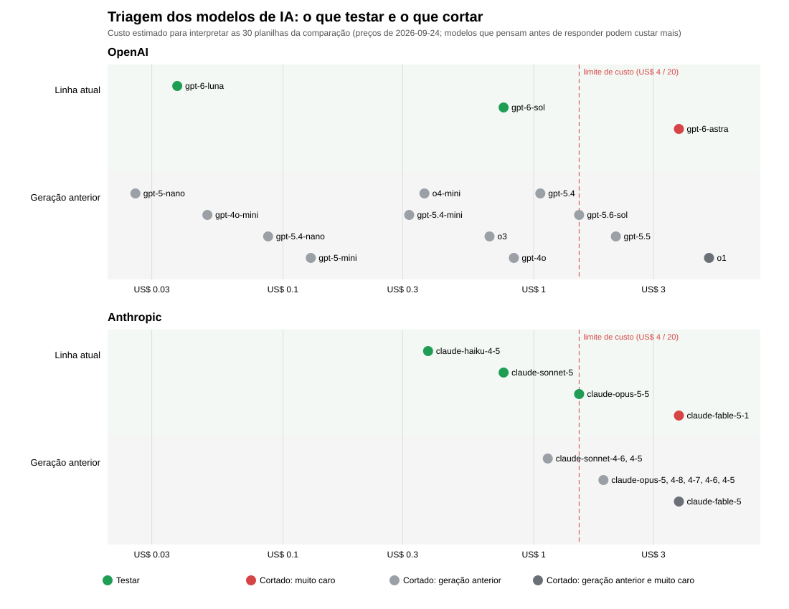

# Avaliação: o que medimos, como e o que ainda falta

> **Data das medições:** 2026-09-24. **Modo:** MOCK (o provedor de IA ainda não foi escolhido, ADR-11).
> Todo número deste documento vem de um arquivo em `data/avaliacao/resultados/` e pode ser refeito com os
> comandos da seção 2. Onde a IA real é necessária, o documento diz **"aguardando o provedor"** e não
> mostra número nenhum.

## 1. Resumo

| O que foi medido | Amostra (N) | Resultado | Situação |
|---|---|---|---|
| Interpretador sem IA (B0, a régua) | 300 planilhas, 4.306 colunas com campo e 746 para abster | Acurácia por campo **50,9%** (IC 95% 49,5% a 52,2%); 8 campos com **0%** | ✅ medido |
| Interpretador com IA (B1 a B5) | as mesmas 300 planilhas | — | ⏳ aguardando o provedor |
| Busca do RAG (hit@k) | 10 consultas por índice | Layout: **100% em k=4**; catálogo: **100% em k=2**; 0 trechos de outra empresa | ✅ medido |
| Fluxo da empresa de ponta a ponta | 9 arquivos, 9 erros injetados | **9/9 homologados**; **9/9 erros achados**, 0 a mais; **0 etapas refeitas** em 26 retomadas | ✅ medido (MOCK) |
| Métricas proxy de negócio | 9 arquivos | **5/9 sem edição manual**; 3,8 decisões humanas por arquivo | ✅ medido (MOCK) |
| Consultor: agente único × supervisor | 12 casos × 2 arquiteturas | **12/12 nas duas**; supervisor faz **~67% mais chamadas** à IA | ✅ estrutura; ⏳ exatidão real |
| Endomarketing | 18 materiais, 83 blocos, 202 adulterações, 8 destaques | **83/83 fiéis**; **202/202 adulterados barrados**; 0 fontes de outra empresa; **0/4 destaques ausentes avisados** | ✅ medido; ⚠️ um resultado negativo |
| Guardrail de injeção (lista) | 24 casos de desenvolvimento + 20 de prova | Prova: **100% de detecção, 0% de falso alarme** | ✅ medido |
| Guardrail (classificador e os dois juntos) | os mesmos 20 da prova | — | ⏳ aguardando o provedor |
| Ataques (testes adversariais) | 14 ataques, 16 testes | Todos barrados | ✅ medido |
| Suíte automática | 497 testes, incluindo ponta a ponta pelas telas | Todos passando | ✅ |
| Comparação de modelos (IA real, B3) | 5 modelos × 30 planilhas; US$ 6,21 | Todos ganham do dicionário (53,4% → 76% a 84%); melhor: `claude-sonnet-5` com 84,4%; 0 respostas fora do contrato | ✅ medido (seção 12) |
| Ganho da IA por tipo de arquivo (IA real, EXP-021) | 7 tipos × 5 arquivos, as mesmas 75 pessoas; US$ 4,78 | 4 obrigatórios certos: **0% → 100%** nos nomes próximos, no cabeçalho difícil, na tabela do Word e no texto corrido; **90%** no texto misturado; empate no padrão do banco; **0 erro silencioso**; US$ 0,003 a US$ 0,027 por funcionário | ✅ medido (seção 13) |

## 2. Como reproduzir

```powershell
# Dados, prova e índices (uma vez)
.\.venv\Scripts\python.exe scripts\gerar_dados.py
.\.venv\Scripts\python.exe scripts\gerar_cabecalhos.py
.\.venv\Scripts\python.exe scripts\build_index.py
# Medições (cada uma confere antes se a prova está congelada)
.\.venv\Scripts\python.exe scripts\avaliar_interpretador.py B0
.\.venv\Scripts\python.exe scripts\avaliar_rag.py
.\.venv\Scripts\python.exe scripts\avaliar_fluxo.py
.\.venv\Scripts\python.exe scripts\avaliar_consultor.py
.\.venv\Scripts\python.exe scripts\avaliar_endomarketing.py
.\.venv\Scripts\python.exe scripts\avaliar_guardrail.py
.\.venv\Scripts\python.exe scripts\medir_tamanho_dos_pedidos.py
# Comparação dos modelos de IA (dinheiro de verdade: precisa das chaves no .env; teto US$ 25)
.\.venv\Scripts\python.exe scripts\comparar_modelos.py
# Testes
.\.venv\Scripts\python.exe -m pytest
```

As medições do fluxo, do Consultor e do Endomarketing rodam num banco **temporário**: o banco local não é
tocado. Os resultados gravados aparecem na sub-aba Desempenho da IA (Telemetria, perfil BANCO); pela decisão 4
do usuário, eles vão para a apresentação executiva, e a sub-aba passa aos indicadores do dia a dia (ADR-82).

## 3. Regras da medição

- **Prova congelada (ADR-37, ADR-58).** 20 arquivos são "lacrados" pela impressão digital (SHA-256):
  - a prova do Interpretador e o vocabulário de teste;
  - os 9 gabaritos;
  - as consultas do RAG, as perguntas do Consultor e os casos do Endomarketing e do guardrail;
  - o próprio código das métricas.

  Os scripts se recusam a medir se algo mudou. Recongelar exige um motivo, que fica gravado com a data
  em `data/avaliacao/congelamento.json` e no Git.
- **Treino e prova separados.** O vocabulário da prova nunca aparece no treino nem nos exemplos do prompt.
  O B0 foi calibrado numa validação tirada do treino (ADR-41).
- **Desenvolvimento × prova.** Ajuste só olhando o desenvolvimento, e a prova é medida uma vez. Vale para o
  guardrail e para a distância do Endomarketing.
- **Resultado negativo também é resultado.** Ele é registrado, não escondido (seção 9).

## 4. Interpretador: B0 a B5

A pergunta de negócio: **a IA entende as colunas de uma planilha nova melhor que um dicionário?** A prova tem
300 planilhas com o vocabulário que o sistema nunca viu (ADR-37).

| Configuração | O que é | Acurácia por campo | IC 95% | Abstenção (recall / precisão) | Tempo por arquivo | Custo |
|---|---|---|---|---|---|---|
| **B0** | Dicionário de sinônimos + comparação aproximada (sem IA) | **50,9%** | 49,5% a 52,2% | 59,4% / 47,7% | 6 ms | zero |
| B1 | LLM só com o contrato | aguardando o provedor | | | | |
| B2 | LLM com o layout inteiro no prompt | aguardando o provedor | | | | |
| B3 | LLM com RAG (layout + histórico) | aguardando o provedor | | | | |
| B4 | Modelo pequeno sem ajuste + RAG | aguardando o provedor | | | | |
| B5 | Modelo pequeno ajustado (Fine-Tuning) + RAG | fora desta versão (ADR-80) | | | | |

**O número geral esconde onde está o problema.** O B0 acerta 3 campos em 100% das vezes, mas tem **8 campos
com 0%**:
- `valor_renda` e `matricula`;
- `nome_unidade`;
- endereço: `municipio_residencial`, `municipio_comercial`, `logradouro_residencial`, `complemento_residencial`
  e `numero_comercial`.

Nesses campos, o nome da coluna na prova não se parece com nenhum sinônimo do treino. É aí que a IA precisa
mostrar ganho (ADR-58).

**Abstenção.** O B0 reconhece só 59% das colunas que deveriam virar pergunta (ex.: "Proventos", que pode ser
bruto ou líquido). Das perguntas que ele cria, 48% eram necessárias. Ou seja, ele chuta onde deveria perguntar.

## 5. Busca do RAG

| Índice | Consultas | hit@1 | hit@2 | hit@4 | k escolhido | Trechos de outra empresa |
|---|---|---|---|---|---|---|
| Layout (campos + histórico) | 8 com resposta | 62,5% | 87,5% | **100%** | 4 | 0 |
| Catálogo de benefícios | 7 com resposta | 85,7% | **100%** | 100% | 2 | 0 |

No catálogo, as perguntas sem resposta ficam longe das certas: a mais próxima está a 0,918, e a certa mais
distante a 0,677. Por isso ali um limite de distância diz "não há". No layout, as duas faixas se encostam
(0,587 × 0,588), então quem diz "não sei" é o Interpretador, não a distância (ADR-42).

## 6. Fluxo da empresa de ponta a ponta

Os 9 arquivos passam pelo fluxo inteiro, com uma **pessoa simulada** que decide pelo gabarito (ADR-59).

| Indicador | Resultado |
|---|---|
| Arquivos homologados | **9 de 9** |
| Erros injetados achados na linha certa | **9 de 9** (recall 100%) |
| Achados que não estavam no gabarito | **0** (precisão 100%) |
| Homologados sem edição manual de valor (proxy de negócio) | **5 de 9** |
| Decisões humanas por arquivo | 3,8 (aceite, correções, homologação) |
| Ciclos de correção por arquivo | 0,9 |
| Tempo de máquina até homologar | ~1 s por arquivo (MOCK) |
| Etapas refeitas ao retomar do ponto de salvamento | **0 em 26 retomadas** |
| Provedor fora do ar na interpretação | o arquivo **para** em "tentar de novo", sem falso sucesso |

Os 4 arquivos com edição tinham um erro que **só a empresa sabe corrigir**:
- um CPF inválido;
- uma data de admissão vazia;
- um salário escrito por extenso e uma linha repetida;
- uma matrícula repetida.

As inclusões reaproveitam o mapeamento já aprovado e não chamam a IA para colunas conhecidas.

**Limite:** a pessoa simulada sempre acerta, e o tempo dela não entra. Isto prova o fluxo (regras, pausas,
retomada e controle humano), não a qualidade da IA real.

## 7. Agente Consultor: agente único × supervisor

São 12 casos (ADR-60):
- 6 perguntas com resposta em números, cada uma com os subagentes, as ferramentas, os filtros e as taxas
  esperados;
- 6 casos de controle: pedir a taxa, dizer que não há dados, recusar lista de CPFs, SQL e ordem para a IA, e
  reconhecer pergunta fora do escopo.

| Arquitetura | Acertos | Chamadas à IA por caso | Chamadas nas perguntas com resposta | Custo |
|---|---|---|---|---|
| Supervisor + 3 subagentes | 12 de 12 | 2,25 | 2 + 1 por subagente (3 a 5; média 3,3) | não medido |
| Agente único | 12 de 12 | 1,42 | sempre 2 | não medido |

As recusas não chamam a IA nenhuma vez. **Leitura:** em MOCK, as duas usam o mesmo simulador, então a
exatidão ainda não decide nada. O que está medido é o **preço estrutural** do supervisor: cerca de 67% mais
chamadas. Com o provedor, o mesmo script mede se esse preço compra exatidão. Se não comprar, o ADR-18 é
revisto.

**Revisto em 2026-09-28 (ADR-117):** com o empate e o preço estrutural, a aplicação passou a usar o **agente
único**; o supervisor continua como o outro braço desta comparação, que com IA real diz se ele volta.

## 8. Agente de Endomarketing

| Indicador | Resultado |
|---|---|
| Materiais gerados (6 empresas × 3 tipos) | 18 de 18 |
| Blocos fiéis às fontes | **83 de 83** |
| Fontes de outra empresa | **0** |
| Blocos adulterados de propósito barrados (número trocado, fonte inventada, fonte de outra empresa) | **202 de 202** |
| Blocos certos mantidos pela mesma conferência | 83 de 83 |
| Destaque que o catálogo traz, achado na seção certa | 4 de 4 |
| Destaque que o catálogo **não** traz, avisado à empresa | **0 de 4** (ver seção 9) |

A adulteração ([ADR-61](decisoes.md#adr-61)) mede a conferência de saída sem depender da IA: vale igual com o
provedor real.

Desde o [ADR-115](decisoes.md#adr-115) (2026-09-28), quem gera é o especialista do banco, com os benefícios que ele
escolhe, e a empresa só baixa o que foi publicado. A avaliação congelada continua chamando o agente sem benefícios
escolhidos (busca pelo RAG em todo o catálogo da empresa), e a conferência de saída é a mesma: os números acima
continuam valendo. Com os benefícios escolhidos, a IA recebe menos trechos, todos do assunto pedido.

## 9. Erros observados e resultados negativos

1. **B0 com 0% em 8 campos** (seção 4). Não é defeito a corrigir no B0: é a régua. Mostra onde a IA
   tem de ganhar.
2. **Endomarketing não avisa destaque parecido com outro assunto (0 de 4).** Nada falso é escrito e nada
   vaza de outra empresa, mas a empresa não é avisada. Num conjunto de desenvolvimento com outros assuntos,
   as distâncias se cruzam:
   - quando o catálogo tem o assunto, até **0,64**;
   - quando não tem, a partir de **0,44**.

   Nenhum limite resolve, então decidir isso é trabalho da IA real (o campo `nao_encontrado` do contrato).
   O simulador **não** foi ajustado para passar nesta prova (ADR-61).
3. **Layout: distância não separa "tem" de "não tem"** (0,587 × 0,588, ADR-42). Por isso o "não sei" do
   layout é do Interpretador.
4. **Revisão de segurança achou um furo real, já corrigido.** Nos serviços, "empresa vazia" queria dizer
   "sem filtro". Agora ela é recusada (ADR-56).

## 10. O que falta medir (depende do provedor de IA)

| Medição | Por que depende | Pronto para rodar? |
|---|---|---|
| B1 a B4 na prova (acurácia por campo, abstenção, IC 95%, tokens, custo, latência) | precisa de um LLM real | quase: as métricas, o IC e o congelamento estão prontos; falta ligar as configurações B1 a B4 ao script `avaliar_interpretador.py`, junto com o provedor |
| B5 (Fine-Tuning) | decidido: fora desta versão (ADR-80) | o dataset de treino fica pronto (`cabecalhos_treino.jsonl`) |
| Consistência: 5 execuções por arquivo | em MOCK, a resposta é sempre igual | falta a opção de repetir no script (junto com B1) |
| Consultor: exatidão, custo e latência reais | precisa de um LLM real | sim: `avaliar_consultor.py` |
| Endomarketing: aviso de destaque ausente pela IA | precisa de um LLM real | sim: `avaliar_endomarketing.py` |
| Guardrail: classificador e os dois juntos | precisa do modelo pequeno | sim: `avaliar_guardrail.py` |
| Regressão a cada mudança de prompt | precisa de um LLM real | os golden estão congelados |
| Tempo da pessoa até homologar | só no uso real | o Painel já mede as etapas humanas |

## 11. Recomendações de melhoria

1. **Ampliar o golden do Consultor** (hoje 12 casos) para dar intervalo de confiança à comparação de
   arquiteturas. Recongelar com o motivo antes de medir.
2. **Medir o aviso de destaque ausente assim que houver provedor.** Se a IA também falhar, a saída é pedir no
   contrato uma confirmação explícita de cobertura por destaque, conferida pelo guardrail de saída.
3. **Ampliar os conjuntos do guardrail** (hoje 20 casos na prova): o 100% é sobre uma amostra pequena.
4. **No piloto, medir o tempo da pessoa** até a homologação, o proxy que falta para o business case.
5. **Usar os 8 campos com 0% do B0** como foco da análise de erro do B3 e do B5: é ali que a IA prova valor.

## 12. Avaliação do provedor de IA: critérios e custo

A escolha do provedor também é uma avaliação: envolve qualidade, custo, disponibilidade de Fine-Tuning e
política de dados. O levantamento completo, com as fontes, está no [ADR-11](decisoes.md#adr-11).

**Critérios (ADR-11):**
- saída estruturada confiável;
- modelo pequeno com Fine-Tuning (para o B5);
- custo por arquivo e teto de gasto;
- política de dados;
- latência.

**Disponibilidade de Fine-Tuning (set/2026).**

| Provedor | Situação |
|---|---|
| OpenAI | Fechado para contas novas |
| Anthropic | Só o antigo Claude 3 Haiku, no Bedrock (Oregon) |
| Google | Só na plataforma empresarial, em modelos 2.5 |
| Together | Ajuste LoRA de modelos abertos por API |

Consequência: o B4 × B5 (mesma base, com e sem ajuste) só é viável com um modelo aberto na Together, e o
provedor principal cuida de B1–B3 e dos agentes.

**Quanto pesa cada chamada (medido).** `scripts/medir_tamanho_dos_pedidos.py` roda o fluxo, o Consultor e o
Endomarketing em MOCK e mede o pedido real e a resposta (o simulador responde no mesmo contrato). Tokens ≈
caracteres ÷ 4: é uma aproximação, porque cada provedor conta do seu jeito, e a margem é de uns 30%.

| Chamada | Tokens de entrada | Tokens de saída |
|---|---|---|
| Interpretador (B3, uma planilha) | ~5.000 | ~1.500 |
| Consultor, pergunta composta (supervisor + 3 subagentes + redação) | ~1.200 | ~200 |
| Endomarketing (um material) | ~500 | ~250 |

**Custo projetado por chamada** (preços de 2026-09-24, em dólares):

| Modelo | Interpretação | Pergunta composta ao Consultor | Material do Endomarketing |
|---|---|---|---|
| Claude Sonnet 5 (US$ 2 / 10) | 0,025 | 0,004 | 0,004 |
| GPT-5.4 (US$ 2,50 / 15) | 0,035 | 0,006 | 0,005 |
| Claude Haiku 4.5 (US$ 1 / 5) | 0,013 | 0,002 | 0,002 |
| GPT-5-mini (US$ 0,25 / 2) | 0,004 | 0,001 | 0,001 |

**Cenários (modelo grande; ordem de grandeza).**

| Cenário | Sonnet 5 | GPT-5.4 |
|---|---|---|
| Comparação entre provedores: B3 em 30 planilhas | ~US$ 0,75 | ~US$ 1,05 |
| B1–B3 na prova inteira (300 planilhas × 3 configurações; o B1 tem prompt menor) | até ~US$ 23 | até ~US$ 32 |
| Consistência: 5 execuções dos 9 arquivos | ~US$ 1,10 | ~US$ 1,60 |
| Uma sessão de demo (10 interpretações, 20 perguntas, 10 materiais) | ~US$ 0,37 | ~US$ 0,52 |
| Uma empresa integrada (a interpretação da carga inicial) | ~US$ 0,03 | ~US$ 0,04 |

**Leitura para o negócio.**
- A interpretação custa **centavos de dólar por empresa**, e as inclusões seguintes reaproveitam o mapeamento
  aprovado. No fluxo medido, o Interpretador foi chamado 7 vezes para 9 arquivos.
- Perto do potencial do business case (≈ R$ 115 MM em 12 meses), o custo de IA não pesa na decisão. O que pesa
  é a qualidade (acurácia e abstenção), a política de dados e a disponibilidade corporativa.
- O plano de avaliação inteiro com um provedor fica na casa de **US$ 30 a 40**. Somam-se ~US$ 4 do treino na
  Together, se houver B5.
- A sessão de demo cabe com folga no teto de gasto de US$ 10 por sessão (decidido em 2026-09-25).

**Triagem dos modelos (decisão do dono do projeto, 2026-09-24).** Os dois provedores preferidos são OpenAI e
Anthropic, que somam 27 modelos à venda. Antes de gastar, fizemos uma triagem com regra explícita:

1. **Geração anterior → cortado.** O provedor ainda vende, mas não é a linha atual; a banca vai perguntar "por que
   este modelo hoje?".
2. **Linha atual acima de US$ 4 / 20 por milhão de tokens → cortado por custo.** É mais que o dobro do
   intermediário, para uma tarefa (entender nomes de colunas) que não pede o modelo mais poderoso.
3. **O resto é testado:** 5 modelos, ~US$ 3,50 nas 30 planilhas (até ~US$ 6 contando o raciocínio do Opus), com
   teto de US$ 25 para a comparação.



*Gráfico gerado por `scripts/grafico_triagem_modelos.py` a partir de `data/avaliacao/modelos_candidatos.json`.
Modelos de mesmo preço aparecem num ponto só.*

| Provedor | Modelo | Geração | Preço (entrada / saída) | Estimativa em 30 planilhas | Decisão |
|---|---|---|---|---|---|
| OpenAI | `gpt-6-astra` | atual | US$ 10 / 50 | US$ 3,79 | cortado: muito caro |
| OpenAI | `gpt-6-sol` | atual | US$ 2 / 10 | US$ 0,76 | **testar** |
| OpenAI | `gpt-6-luna` | atual | US$ 0,1 / 0,5 | US$ 0,04 | **testar** |
| OpenAI | `gpt-5.6-sol` | anterior | US$ 4 / 20 | US$ 1,52 | cortado: geração anterior |
| OpenAI | `gpt-5.5` | anterior | US$ 5 / 30 | US$ 2,12 | cortado: geração anterior |
| OpenAI | `gpt-5.4` | anterior | US$ 2.5 / 15 | US$ 1,06 | cortado: geração anterior |
| OpenAI | `gpt-5.4-mini` | anterior | US$ 0,75 / 4.5 | US$ 0,32 | cortado: geração anterior |
| OpenAI | `gpt-5.4-nano` | anterior | US$ 0,2 / 1.25 | US$ 0,09 | cortado: geração anterior |
| OpenAI | `gpt-5-mini` | anterior | US$ 0,25 / 2 | US$ 0,13 | cortado: geração anterior |
| OpenAI | `gpt-5-nano` | anterior | US$ 0,05 / 0,4 | US$ 0,03 | cortado: geração anterior |
| OpenAI | `gpt-4o` | anterior | US$ 2.5 / 10 | US$ 0,83 | cortado: geração anterior |
| OpenAI | `gpt-4o-mini` | anterior | US$ 0,15 / 0,6 | US$ 0,05 | cortado: geração anterior |
| OpenAI | `o1` | anterior | US$ 15 / 60 | US$ 5,00 | cortado: geração anterior e muito caro |
| OpenAI | `o3` | anterior | US$ 2 / 8 | US$ 0,67 | cortado: geração anterior |
| OpenAI | `o4-mini` | anterior | US$ 1.1 / 4.4 | US$ 0,37 | cortado: geração anterior |
| Anthropic | `claude-fable-5-1` | atual | US$ 10 / 50 | US$ 3,79 | cortado: muito caro |
| Anthropic | `claude-opus-5-5` | atual | US$ 4 / 20 | US$ 1,52 | **testar** |
| Anthropic | `claude-sonnet-5` | atual | US$ 2 / 10 | US$ 0,76 | **testar** |
| Anthropic | `claude-haiku-4-5` | atual | US$ 1 / 5 | US$ 0,38 | **testar** |
| Anthropic | `claude-fable-5` | anterior | US$ 10 / 50 | US$ 3,79 | cortado: geração anterior e muito caro |
| Anthropic | `claude-opus-5` | anterior | US$ 5 / 25 | US$ 1,90 | cortado: geração anterior |
| Anthropic | `claude-opus-4-8` | anterior | US$ 5 / 25 | US$ 1,90 | cortado: geração anterior |
| Anthropic | `claude-opus-4-7` | anterior | US$ 5 / 25 | US$ 1,90 | cortado: geração anterior |
| Anthropic | `claude-opus-4-6` | anterior | US$ 5 / 25 | US$ 1,90 | cortado: geração anterior |
| Anthropic | `claude-opus-4-5` | anterior | US$ 5 / 25 | US$ 1,90 | cortado: geração anterior |
| Anthropic | `claude-sonnet-4-6` | anterior | US$ 3 / 15 | US$ 1,14 | cortado: geração anterior |
| Anthropic | `claude-sonnet-4-5` | anterior | US$ 3 / 15 | US$ 1,14 | cortado: geração anterior |

**Atenção:** a Anthropic informa que o `claude-haiku-4-5` pode ser aposentado a partir de 15/10/2026. Se ele vencer
como modelo pequeno, é preciso um plano para a banca.

**Os cortados não foram descartados para sempre.** Se, no fim do projeto, algum resultado pedir, dá para testar
outros (por exemplo, um modelo "mais caro" de cada provedor como referência de qualidade) com o mesmo script.

**Resultado da comparação (2026-09-25, IA real).** B3 nas mesmas 30 planilhas da prova congelada; gasto total
US$ 6,21 de US$ 25; **0 falhas de provedor e 0 respostas fora do contrato** nas 150 interpretações.
Fonte: `data/avaliacao/resultados/comparacao_modelos.json` (`scripts/comparar_modelos.py`).

| Modelo | Acurácia por campo | IC 95% | Abstenção (recall / precisão) | Custo nas 30 | Custo por planilha | Tempo por planilha |
|---|---|---|---|---|---|---|
| B0 (dicionário, sem IA) | 53,4% | 50,1% a 56,5% | 59,5% / 55,6% | zero | zero | < 0,01 s |
| `claude-sonnet-5` | **84,4%** | 81,1% a 87,5% | 98,8% / 53,2% | US$ 1,67 | US$ 0,0558 | 33,54 s |
| `claude-opus-5-5` | 82,3% | 78,3% a 86,0% | 100,0% / 50,3% | US$ 3,20 | US$ 0,1065 | 30,47 s |
| `claude-haiku-4-5` | 81,6% | 78,0% a 85,0% | 92,9% / 48,8% | US$ 0,47 | US$ 0,0155 | 14,03 s |
| `gpt-6-sol` | 77,6% | 73,7% a 81,0% | 100,0% / 44,4% | US$ 0,81 | US$ 0,0272 | 26,77 s |
| `gpt-6-luna` | 76,3% | 72,7% a 80,4% | 100,0% / 43,1% | US$ 0,06 | US$ 0,0018 | 29,65 s |

**Leitura.**
1. **A IA vale o custo:** todos os modelos ganham do dicionário com folga, de 53,4% para 76% a 84% de acurácia por
   campo, e reconhecem 93% a 100% das colunas que pedem ajuda (o B0 reconhece 60%).
2. **O melhor foi o `claude-sonnet-5` (84,4%)**, e o intervalo de confiança dele não encosta nos dos dois modelos da
   OpenAI: a diferença não parece sorte. Entre os três modelos da Anthropic, os intervalos se cruzam; com 30 planilhas,
   Sonnet, Opus e Haiku ficam estatisticamente próximos.
3. **O mais caro não foi o melhor:** o `claude-opus-5-5` custou o dobro do Sonnet e acertou um pouco menos.
4. **O raciocínio pesa no custo:** Sonnet e Opus gastaram 2 a 3 vezes a saída estimada (tokens de "pensar" antes de
   responder), e o custo real ficou o dobro da estimativa da seção acima.
5. **Todos pedem ajuda demais:** a precisão da abstenção fica entre 43% e 53%, ou seja, cerca de metade dos "não tenho
   certeza" era desnecessária. É um erro do lado seguro (pergunta em vez de chutar), mas gera trabalho para a empresa;
   ajustar o prompt para isso é uma melhoria a medir.
6. **Custo por empresa:** a interpretação de uma planilha custa de US$ 0,002 (`gpt-6-luna`) a US$ 0,11 (`claude-opus-5-5`);
   com o Sonnet, ~US$ 0,06. Continua sendo centavos perto do potencial do business case.

**Limites:** 30 planilhas dão intervalos de ±3 a 4 pontos; a prova tem só nomes de coluna (no uso real, a IA também vê
as amostras de cada coluna: mascaradas na época desta medição e reais desde o ADR-101, com o prompt
`interpretador_v2`; a medição precisa ser refeita com IA real); com a IA real, as respostas variam um pouco a cada
execução (a consistência ainda será medida).

## 13. Ganho da IA por tipo de arquivo

**A pergunta:** em cada tipo de arquivo que as empresas mandam, quanto a IA acrescenta ao acerto e às perguntas que
sobram para a empresa, e quanto custa? (EXP-021, 30/09/2026, IA real pelo Bedrock: Claude Sonnet 4.6 e Amazon Nova 2
Lite.)

**Como foi medido:**
- **As mesmas 75 pessoas** fictícias foram escritas em **7 tipos de arquivo**, com 5 arquivos de 15 pessoas por tipo
  (`scripts/gerar_prova_por_tipo.py`, semente 20260930). Só o formato muda de um tipo para o outro.
- **Cada arquivo passou duas vezes pelo caminho da tela** (`services/cadastro.py`), num banco novo, como o primeiro
  envio de uma empresa:
  - **sem IA**, só com as regras: o dicionário B0 no lugar do Interpretador, a tabela e as fichas do Word lidas por
    regra, e o texto corrido com a IA fora do ar;
  - **com IA**, como a aplicação funciona hoje: o Interpretador com o formato garantido, o Leitor e o Conferidor.
- **Uma pessoa simulada responde só o que o sistema pergunta** sobre as colunas, pelo gabarito. As pendências das
  pessoas ficam sem resposta: são o trabalho que sobra.
- **O congelamento:** a prova, a foto do parâmetro v7 e a régua (`eval/ganho_por_tipo.py`, `eval/teste_pareado.py` e
  `scripts/avaliar_ganho_por_tipo.py`) foram congeladas antes de medir.

| Tipo de arquivo | Acerto por campo (sem → com IA) | 4 obrigatórios certos | Pessoas sem pergunta | Perguntas por arquivo | Custo por funcionário | Tempo (p50, com IA) |
|---|---|---|---|---|---|---|
| T1 · planilha no padrão do banco | 100% → 100% | 100% → 100% | 100% → 100% | 2,0 → **0,0** | US$ 0,0071 | 39 s |
| T2 · colunas fora de ordem, a mais e faltando | 100% → 100% | 100% → 100% | 100% → 100% | 3,2 → **0,0** | US$ 0,0059 | 32 s |
| T3 · nomes próximos (vocabulário da prova) | 60,7% → **98,8%** | 0% → **100%** | 0% → **100%** | 6,4 → 2,2 | US$ 0,0038 | 25 s |
| T4 · cabeçalho difícil (sem nome, "Nome - CPF") | 49,3% → **100%** | 0% → **100%** | 0% → **100%** | 3,8 → 1,2 | US$ 0,0030 | 19 s |
| T5 · Word com tabela ou fichas | 72,1% → **100%** | 0% → **100%** | 0% → **100%** | 2,0 → 3,0 | US$ 0,0029 | 15 s |
| T6 · Word com texto corrido simples ou variado | 0% (recusado) → **99,8%** | 0% → **100%** | 0% → **100%** | recusado → **0,0** | US$ 0,0197 | 75 s |
| T7 · Word com texto misturado e armadilhas (4 arquivos) | 0% (recusado) → **98,9%** | 0% → **90%** | 0% → **33%** | recusado → 10,0 | US$ 0,0267 | 93 s |

**O ganho do acerto por campo** (com IA − sem IA; IC 95% por bootstrap sorteando os arquivos; McNemar exato com a
correção de Holm nos 7 tipos):

| Tipo | Ganho | IC 95% | Células que só o com IA acertou × só o sem IA | Valor-p (Holm) | Custo por ponto ganho |
|---|---|---|---|---|---|
| T1 e T2 | 0 ponto | 0 a 0 | 0 × 0 | 1 | — |
| T3 | **+38,1 pontos** | +29,7 a +45,4 | 476 × 0 | < 0,001 | US$ 0,0075 |
| T4 | **+50,7 pontos** | +46,3 a +54,7 | 570 × 0 | < 0,001 | US$ 0,0044 |
| T5 | **+27,9 pontos** | +25,0 a +30,3 | 285 × 0 | < 0,001 | US$ 0,0078 |
| T6 | **+99,8 pontos** | +99,6 a +100 | 883 × 0 | < 0,001 | US$ 0,0148 |
| T7 | **+98,9 pontos** | +98,6 a +99,2 | 1.084 × 0 | < 0,001 | US$ 0,0162 |

**A leitura:**
1. **No padrão do banco (T1 e T2), o dicionário empata com a IA:** os dois acertam tudo. A IA só tira as 2 a 3
   perguntas por arquivo, que no dicionário vêm do campo novo do CBO, confundido com o código da unidade (o dicionário
   é anterior ao ADR-143). Aqui, a IA custa ≈ US$ 0,10 por arquivo sem ganho de acerto.
2. **Onde a empresa foge do padrão, a IA é o que faz o cadastro andar:**
   - nos nomes próximos, no cabeçalho difícil e na tabela do Word, as pessoas com os 4 obrigatórios certos vão de 0%
     para 100%;
   - sem IA, a mesma planilha trava numa pendência de "coluna obrigatória que falta" (o CBO, a renda ou a admissão com
     um nome que o dicionário não conhece);
   - no texto corrido, sem a IA o documento simplesmente volta para a empresa.
3. **As perguntas que sobram com IA são as certas:**
   - no T3, sobre colunas ambíguas de verdade ("Dt.", "Proventos", "Cód.", "Nº Empresa");
   - no T4, sobre a coluna de datas sem nome, em vez de chutar;
   - no T5, sobre se CEP, Cidade e UF são do endereço de casa ou do trabalho;
   - no T7, **32 de 32 perguntas esperadas** (o CPF que "vem depois" e as duas datas de admissão) e **44 de 44
     armadilhas respeitadas** (nada inventado).
4. **Nenhum erro silencioso, em nenhum tipo e em nenhum braço:** nenhuma pessoa ficou "pronta" com um obrigatório
   errado. No T7, 6 CPFs que estavam no texto ficaram em branco, mas com uma pergunta, e 5 deles eram da pessoa com o
   "PIS ilegível" na mesma linha (a dúvida contagiou o CPF). Houve 2 alarmes falsos em 60 pessoas.
5. **O custo:**
   - de US$ 0,003 a US$ 0,027 por funcionário, e o texto corrido é o mais caro (uma chamada grande por pessoa, mais a
     conferência);
   - mesmo no pior caso, é desprezível perto dos R$ 366,62 de MOB por cliente do business case;
   - o tempo com IA vai de 15 s a 93 s por arquivo de 15 pessoas, contra 3 s a 9 s só com as regras.

**Ao lado, os números que já existiam** (o realismo):
- **EXP-014, só os nomes das colunas, sem as amostras:** o dicionário acertou 53,4%, o Sonnet 4.6, 82,9%, e o Nova 2
  Lite, 81,6%. Aqui, com as amostras de cada coluna e pelo caminho real, o T3 chega a 98,8%.
- **EXP-010, os mesmos níveis de documento:** tabela e fichas, 100% por regra; texto simples e variado, 100%; texto
  misturado, 98,9%.
- **EXP-017, o lote guardado, com arquivos mais variados:** 65 de 67 pessoas certas na tabela, mas **0 de 7
  documentos** exatos no texto corrido difícil.

**Os limites:**
- **Os arquivos são sintéticos e saem dos geradores do projeto.** Os números de texto corrido são o teto: o texto
  corrido difícil de verdade (EXP-017) ainda falha.
- **O "sem IA" é o dicionário B0 como ele é hoje.** Ele não conhece o CBO nem "Salário". Manter o dicionário à mão
  fecharia parte da diferença no T3 a T5, mas a cada campo ou nome novo seria preciso atualizá-lo, e a IA lê a
  descrição do parâmetro.
- **O T7 ficou com 4 arquivos**, porque a trava de custo parou antes do 5º. Foram gastos US$ 4,78 de US$ 5.
- **Com 5 arquivos por tipo, o intervalo sorteando os arquivos é grosso.** O McNemar, célula a célula, é o teste
  principal.
- **O 1º arquivo de cada medição carrega o processo** (~15 s a mais). O p95 do T1 fica inflado nos dois braços; o p50
  não muda.

**A decisão:** a IA fica em todos os tipos, porque ela custa centavos e é o que leva do "trava" ao "cadastra". Duas
melhorias ficam como sugestão, sem medir de novo agora:
- **reconhecer o padrão do banco sem chamar a IA:** quando todas as colunas têm o nome técnico do parâmetro, o dicionário
  já acerta tudo, o que economiza ≈ US$ 0,10 por arquivo;
- **não deixar a dúvida de um campo opcional contaminar um obrigatório da mesma linha** (o caso do "PIS ilegível" ao
  lado do CPF).

**Para refazer:**
```
python scripts/gerar_prova_por_tipo.py                                  # a prova (a mesma, pela semente)
python scripts/avaliar_ganho_por_tipo.py --etapa medir --braco sem_ia   # sem custo
python scripts/avaliar_ganho_por_tipo.py --etapa medir --braco com_ia --teto-usd 5   # IA real
python scripts/avaliar_ganho_por_tipo.py --etapa resumir
```
Os resultados ficam em `data/avaliacao/resultados/ganho_por_tipo*.json`.

Ver também: [histórico de cada experimento](experimentos.md) · [decisões (ADRs 11, 37, 41, 42 e 55 a 66)](decisoes.md) · [dados e ficha do dataset](dados.md).
