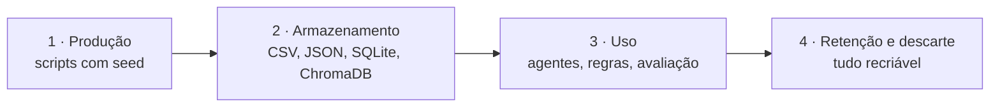

# Dados do Integra Folha: ciclo de vida e ficha do dataset sintético

> Responde ao enunciado: **como os dados da empresa fictícia são produzidos, armazenados e usados**.
> Decisões relacionadas: ADR-21 (dados sintéticos com seed), ADR-37 (treino × teste), ADR-41 (calibração do B0),
> ADR-42 (embeddings locais), ADR-96 e ADR-101 (a IA vê os dados, pelo AWS Bedrock), ADR-102 (a empresa vê a conta
> de cada funcionário dela). Ver `decisoes.md`.

## 1. Princípio

**Todos os dados são sintéticos.** Nenhum dado vem de pessoa, empresa ou arquivo real, nem do layout
real do banco (material interno). Tudo é gerado por scripts com **seed fixa**: a mesma seed produz
exatamente os mesmos arquivos, em qualquer máquina, e os testes automáticos conferem isso.

## 2. Ciclo de vida



### 2.1 Produção

| Script | Seed | O que gera |
|---|---|---|
| `scripts/dividir_vocabulario.py` | 42 | Divide os 267 sinônimos de colunas em **treino (179)** e **teste (88)**, antes de qualquer outro dado |
| `scripts/gerar_dados.py` | 42 | Empresas, funcionários (gabarito), base do banco, vínculos de folha, faixas de renda por cargo |
| `scripts/montar_envios.py` | 42 (chamado pelo `gerar_dados.py`) | Os arquivos que as empresas "enviam" (6 cargas iniciais + 3 inclusões), cada um num formato e com erros escondidos, e o gabarito (`data/golden/`) |
| `scripts/gerar_cabecalhos.py` | 2026 | 1.500 cabeçalhos de treino, 300 de prova e 179 mapeamentos "já homologados" |
| `scripts/calibrar_b0.py` | 11 | Escolhe comparador e limite do B0 numa validação tirada do treino |
| `scripts/build_index.py` | — | Os dois índices do RAG a partir das fontes vigentes |

Fontes escritas à mão (também fictícias): layout v1 (`data/contratos/layout_v1.csv`), regras de
validação (`regras_v1.json`), premissas financeiras v1 (`data/parametros/premissas_v1.json`, valores do
business case) e catálogo de benefícios das 6 empresas (`data/parametros/catalogo/*.md`).

### 2.2 Armazenamento

| Onde | O quê | No Git? |
|---|---|---|
| `data/synthetic/`, `data/golden/`, `data/vocabulario/`, `data/avaliacao/` | Dados gerados e gabaritos | Sim (pequenos e reprodutíveis) |
| `data/synthetic/envios/` | Arquivos de envio (.xlsx/.csv) | **Não**: o Excel grava a hora da criação, então os bytes mudam a cada geração; o teste compara o conteúdo |
| `storage/integra_folha.db` (SQLite) | Usuários (senha só como hash), sessões (só hash do ingresso), parâmetros e catálogo versionados; depois, processamentos e auditoria | **Não** (recriado pelos scripts) |
| `storage/indices/` (ChromaDB) | Índices do RAG: conhecimento do layout e catálogo | **Não** (refeito por `build_index.py`) |
| `storage/modelos/` | Modelo de embeddings (220 MB), baixado uma vez | **Não** |

### 2.3 Uso: quem lê o quê

| Consumidor | Lê | Nunca lê |
|---|---|---|
| Interpretador (LLM) | Cabeçalhos e **amostras reais** (os 3 primeiros valores diferentes de cada coluna); trechos do RAG de layout | Linhas completas da folha; dados de outra empresa |
| Leitor de Documentos (LLM) | O texto do documento enviado, como está (ADR-101) | Documentos de outra empresa |
| Normalizador e Validador (regras) | O arquivo completo, **localmente** | — |
| Assistente de Correção (LLM) | As pendências da própria empresa, com o valor real | Dados de outra empresa |
| Endomarketing (LLM) | Catálogo **da empresa escolhida pelo especialista do banco**, só os benefícios que ele marcou e os canais de atendimento, filtrado no serviço (ADR-115) | Catálogo de outra empresa; benefício que o banco não escolheu |
| Motor de planejamento (regras) | Só dados **homologados** e só campos com `uso_comercial_permitido` | Campos sensíveis |
| Consultor e subagentes (LLM) | Só **visões agregadas** | Qualquer linha individual |
| Empresa (tela "Acompanhar cadastros") | A conta aberta de cada funcionário **dela** (agência, conta e data de abertura), por consentimento dado na abertura (ADR-102) | Funcionários de outra empresa |
| Telemetria (Desempenho da IA) | Identificadores de processamento, etapas, tempos | CPF, nome, salário |
| Avaliação (B0 a B5) | Cabeçalhos de prova | Nada do vocabulário de teste entra no treino, no few-shot ou no RAG |

### 2.4 Retenção e descarte

Como tudo é sintético e recriável, apagar `storage/` e rodar os scripts devolve o sistema ao estado
inicial. Em produção, valeriam as regras de retenção do banco e da LGPD: original do arquivo
preservado com hash (ADR-31), prazo de guarda definido pelo jurídico e descarte registrado.

**Decisão do usuário (2026-09-26, ADR-71 revisto):** o ponto de salvamento do fluxo (checkpoint do LangGraph, a
memória de curto prazo de cada envio) é **guardado para sempre**. Ele não tem dado pessoal (só a etapa, as contagens e
as escolhas) e mostra exatamente onde a empresa parou, mesmo meses depois (ex.: a empresa descobre que deixou de
enviar parte da equipe). A limpeza de 90 dias saiu. O envio, o arquivo final, o mapeamento aprovado e a auditoria
continuam guardados como antes.

## 3. Ficha do dataset sintético

### 3.1 Motivação

Permitir construir, testar e avaliar o sistema de ponta a ponta **sem dado real**, com os problemas
que aparecem de verdade na integração de folha: formatos diferentes, nomes de coluna livres, erros de
digitação, renda incoerente com o cargo, duplicidades e clientes "falso não folha".

### 3.2 Composição

| Conjunto | Tamanho |
|---|---|
| Empresas | 6 (setores, cidades e formatos diferentes), com CNPJ sintético válido |
| Funcionários (gabarito com os 44 campos) | 256 |
| Correntistas na base do banco | 131 (oferta ativa só com autorização, e só para correntista) |
| Falsos não folha (correntistas cuja folha não é reconhecida) | 68 |
| Cargos com faixa de renda de referência | 14 |
| Arquivos de envio | 6 cargas iniciais + 3 inclusões, cada um com gabarito |
| Cabeçalhos para treino / prova | 1.500 / 300 (5.052 colunas na prova) |
| Mapeamentos "já homologados" (histórico) | 179, só com vocabulário de treino |
| Catálogo de benefícios | 6 documentos Markdown, pacotes diferentes por empresa |
| Consultas de teste do RAG | 10 por índice |

### 3.3 Erros injetados de propósito (com gabarito)

| Empresa | Arquivo e desafio de formato | Erro escondido |
|---|---|---|
| Aurora (EMP001) | XLSX simples | CPF com dígito verificador inválido (linha 7) |
| Horizonte (EMP002) | CSV com `;`, Windows-1252, datas DD/MM/AAAA, vírgula decimal | Data de admissão vazia (linha 12) |
| Brisa (EMP003) | Nomes de coluna alternativos; CPF e matrícula como número (zeros perdidos) | Diretor com renda de R$ 1.100 |
| Vale Verde (EMP004) | Cabeçalho na linha 4 e colunas extras | Matrícula repetida (linha 20) |
| Prisma (EMP005) | Valores como texto ("R$ 3.150,00") | Renda por extenso (linha 9); pessoa duplicada (linhas 29 e 30) |
| Atlântico (EMP006) | Coluna ambígua "Vencimentos" | Rendas fora do cargo (≈10× a mediana; auxiliar com R$ 38.000) |
| Inclusões | Mesmas colunas (Aurora), colunas diferentes (Horizonte) | Funcionário já homologado na empresa (Brisa) |

### 3.4 Separação treino × prova

O vocabulário de sinônimos foi dividido **antes** de gerar qualquer dado. Colunas ambíguas e extras
também têm listas separadas. Testes automáticos garantem que nenhum termo da prova aparece no treino,
no histórico de mapeamentos ou na validação do B0.

### 3.5 Limitações e vieses conhecidos

- **Nomes** saem de listas curtas de nomes e sobrenomes brasileiros comuns: não representam a
  diversidade real.
- **CPFs** são sintéticos com dígito verificador válido. Um número assim pode, por acaso, coincidir
  com o CPF de uma pessoa real; por isso, o dataset **nunca** pode ser usado fora deste projeto nem
  cruzado com bases reais. E-mails usam o domínio reservado `.example`.
- **Rendas** seguem faixas simplificadas por cargo (mediana e dispersão fictícias); não refletem o
  mercado de trabalho.
- **Cabeçalhos** só em português, com variações geradas por regras (maiúsculas, espaços, erros de
  digitação); planilhas reais podem ter problemas que o gerador não imagina.
- **Seis empresas** é pouco para conclusões sobre o negócio: os números servem para demonstrar o
  método, não para estimar resultado real.

### 3.6 Usos

- **Permitidos:** desenvolvimento, testes automáticos, avaliação B0–B5, demonstração na banca.
- **Proibidos:** treinar modelo para uso fora do projeto; tratar os números como estimativa real;
  cruzar com qualquer base real.

### 3.7 Como regenerar

```bash
python scripts/gerar_dados.py            # inclui os arquivos de envio e o gabarito
python scripts/gerar_cabecalhos.py && python scripts/calibrar_b0.py
python scripts/build_index.py
python scripts/avaliar_interpretador.py B0 && python scripts/avaliar_rag.py
```
